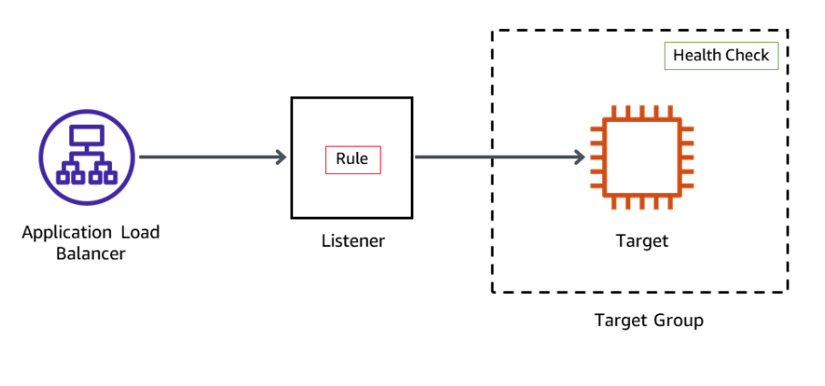

# Hands-on 3: Creating a Database Layer in Your Amazon VPC Infrastructure

OVERVIEW

A backend database plays an important role in any environment, and the security and access control to this 
critical resource is vital to any architecture. In this hands-on, you create an Amazon Aurora database (DB) 
cluster to manage a MySQL database and an Application Load Balancer (ALB). The Amazon Web Services (AWS) Security 
pillar of the Well-Architected Framework recommends keeping people away from data; as such, the database is 
separated from the front end using the Application Load Balancer. The Application Load Balancer routes traffic to 
healthy Amazon Elastic Compute Cloud (Amazon EC2) instances that hosts the front-end application. This provides 
high availability and allow communication to the database to happen behind the Application Load Balancer in a 
private subnet.

After completing this hands-on, you should know how to do the following:

- Create an Amazon Relational Database Service (Amazon RDS) database instance.
- Create an Application Load Balancer.
- Create an HTTP listener for the Application Load Balancer.
- Create a target group.
- Register targets with a target group.
- Test the load balancer and the application connectivity to the database.
- Review the Amazon RDS DB instance metadata using the console.
- Optional Task: Create an Amazon RDS read replica in a different AWS Region.


## Task 1: Create network infrastructure

- Type 'VPC' in the search box of AWS Management Console and choose it.
- From the left-hand menu, choose 'Your VPCs'
- Choose 'Create VPC' and follow these settings:

```text
Resources to create: VPC and more (Notice the resource map in opened window)
Name tag auto-generation: Select 'Auto-generate' and type 'Lab'
IPv4 CIDR block: 10.0.0.0/20
IPv6 CIDR block: No IPv6 CIDR block
Number of Availability Zones (AZs): 2
Number of public subnets: 2
Number of private subnets: 2
NAT gateways ($): In 1 AZ
VPC endpoints: None
DNS options: check 'Enable DNS hostnames' and 'Enable DNS resolution'
```

Choose 'Create VPC'. Observe the 'Resource Map' section.

By doing this, the resources including VPC, Route Tables, Subnets and IGW are easily created using the 
'VPC and more' option. Note that these resources can be also created explicitly.

## Task 2: Create Security Groups and IAM Role

The security groups should be created in the way that the database will be secured. That is,
the internet facing layer will be load balancer and the application will be accessible behind
the load balancer. Then, the database will be accessible only from EC2 instances on which the
application is running.

### Task 2.1: Create Load Balancer Security Group

- In the left navigation pane, choose 'Security groups'.
- Choose 'Create security group' and follow these settings:

```text
Security group name: LabALBSecurityGroup
Description: Enable access to App
VPC: Lab-VPC
Inbound rules: Add rule (Type: HTTP, Source: Anywhere-IPv4)
Tags: Add new tag (Key: Name, Value: Lab-ALB-SG)
```

and choose 'Create security group'.

### Task 2.2: Create EC2 Instance Security Group

- In the left navigation pane, choose 'Security groups'.
- Choose 'Create security group' and follow these settings:

```text
Security group name: LabAppSecurityGroup
Description: Enable access to App
VPC: Lab-VPC
Inbound rules: Add rule (Type: HTTP, Source: Lab-ALB-SG)
Tags: Add new tag (Key: Name, Value: Lab-App-SG)
```

and choose 'Create security group'.

### Task 2.3: Create Database Security Group

- In the left navigation pane, choose 'Security groups'.
- Choose 'Create security group' and follow these settings:

```text
Security group name: LabDBSecurityGroup
Description: Enable access to MySQL
VPC: Lab-VPC
Inbound rules: Add rule (Type: MYSQL/Aurora, Source: Lab-App-SG)
Tags: Add new tag (Key: Name, Value: Aurora-DB)
```

and choose 'Create security group'

### Task 2.4: Create IAM Role

- Type 'IAM' in the search bar and navigate to service page.
- From the left-hand side of the page, choose 'Roles'. Then, choose 'Create role'.
- Follow these settings: 

```text
Trusted entity type: AWS Service
Use case: EC2
```

Click 'Next' and continue ...

```text
Policies : AmazonSSMManagedInstanceCore
```

Click 'Next' and continue ...

```text
Role Name: AppRole
Description: The policy for Amazon EC2 Role to enable AWS Systems Manager service core functionality.
```

Click 'Create role' and finish this part.

## Task 3: Launch EC2 Instances

- Type 'EC2' in the search bar and navigate to service page.
- From the left-hand side of the page, choose 'Instances'. Then, choose 'Launch instances'.
- Follow these settings: 

```text
Name: AppServer1
Amazon Machine Image (AMI): Amazon Linux 2023
Instance type: t3.micro
Key-pair name: Proceed without key-pair
Network settings -> Edit
VPC: LabVPC
Subnet: Private Subnet 1
Firewall (security groups): Select existing security group
Common security groups: LabAppSecurityGroup
Advanced Details -> IAM Instance Profile: AppRole
Advanced Details -> User data:
```

```bash
#!/bin/bash

# Install Apache Web Server and PHP
# Installs for AL2023
dnf update -y
dnf install -y httpd wget php-fpm php-mysqli php-json php php-devel

# Download Lab files
wget https://hepapi-aws-session-files.s3.ap-northeast-1.amazonaws.com/Session3-Compute%26Database/inventory-app.zip
# wget https://us-east-1-tcprod.s3.us-east-1.amazonaws.com/courses/ILT-TF-200-ARCHIT/v7.7.11.prod-feed4ba8/lab-3-RDS/scripts/inventory-app.zip
unzip inventory-app.zip -d /var/www/html/

# Download and install the AWS SDK for PHP
wget https://hepapi-aws-session-files.s3.ap-northeast-1.amazonaws.com/Session3-Compute%26Database/aws.zip
# wget https://github.com/aws/aws-sdk-php/releases/download/3.295.2/aws.zip
unzip aws -d /var/www/html
unzip /var/www/html/aws.zip -d /var/www/html/

# Turn on web server
systemctl enable httpd
systemctl start httpd
```

Click 'Launch instance'.

- From the left-hand side of the page, choose 'Instances'. Then, choose 'Launch instances'.
- Follow these settings: 

```text
Name: AppServer2
Amazon Machine Image (AMI): Amazon Linux 2023
Instance type: t3.micro
Key-pair name: Proceed without key-pair
Network settings -> Edit
VPC: LabVPC
Subnet: Private Subnet 2
Firewall (security groups): Select existing security group
Common security groups: LabAppSecurityGroup
Advanced Details -> IAM Instance Profile: AppRole
Advanced Details -> User data:
```

```bash
#!/bin/bash

# Install Apache Web Server and PHP
# Installs for AL2023
dnf update -y
dnf install -y httpd wget php-fpm php-mysqli php-json php php-devel

# Download Lab files
wget https://hepapi-aws-session-files.s3.ap-northeast-1.amazonaws.com/Session3-Compute%26Database/inventory-app.zip
# wget https://us-east-1-tcprod.s3.us-east-1.amazonaws.com/courses/ILT-TF-200-ARCHIT/v7.7.11.prod-feed4ba8/lab-3-RDS/scripts/inventory-app.zip
unzip inventory-app.zip -d /var/www/html/

# Download and install the AWS SDK for PHP
wget https://hepapi-aws-session-files.s3.ap-northeast-1.amazonaws.com/Session3-Compute%26Database/aws.zip
# wget https://github.com/aws/aws-sdk-php/releases/download/3.295.2/aws.zip
unzip aws -d /var/www/html
unzip /var/www/html/aws.zip -d /var/www/html/

# Turn on web server
systemctl enable httpd
systemctl start httpd
```

Click 'Launch instance'.

## Task 4: Create an Amazon RDS database

In this task, you create an Aurora DB cluster that is compatible with MySQL. An Aurora DB cluster consists 
of one or more DB instances and a cluster volume that manages the data for those DB instances.

Amazon Aurora is a fully managed relational database engine that is compatible with MySQL and PostgreSQL. 
Aurora is part of the managed database service, Amazon RDS. Amazon RDS is a web service that makes it 
easier to set up, operate, and scale a relational database in the cloud.

- At the top of the AWS Management Console, in the search bar, search for and choose 'RDS'.
- In the left navigation pane, choose 'Databases'. Choose 'Create database'.
- In the displayed page, 'choose a database creation method' section, select 'Standard create'.
- In the 'Engine options' section, select 'Aurora (MySQL Compatible)' as 'Engine type'.
- In the 'Settings' section, configure the following:

```text
DB cluster identifier: aurora
Master username: dbadmin
Credentials management: Self managed
Master password: Type 'LabPassword' or any individual password
Confirm master password: Type 'LabPassword' or any individual password
```

- In the 'Instance configuration' section, configure the following:

```text
DB instance class: Burstable classes (includes t classes)
Instance type: db.t3.small
```

- In the 'Availability & durability' section, for 'Multi-AZ deployment', select 'Don’t create an Aurora Replica'.

Amazon RDS Multi-AZ deployments provide enhanced availability and durability for DB instances, making 
them a natural fit for production database workloads. When you provision a Multi-AZ DB instance, Amazon 
RDS automatically creates a primary DB instance and synchronously replicates the data to a standby 
instance in a different Availability Zone. 

- In the 'Connectivity' section, configure the following:

```text
Virtual private cloud (VPC): LabVPC
DB subnet group: default
Public access: No
VPC security group (firewall): Choose existing
Existing VPC security groups:
-> To remove the default security group from the Existing VPC security groups field, select the 'X'.
-> In the 'Existing VPC security groups' dropdown menu, enter 'LabDBSecurityGroup' to choose this option.
```
 
Subnets are segments of an IP address range in an Amazon VPC that you designate to group your resources 
based on security and operational needs. A DB subnet group is a collection of subnets (typically private) 
that you create in an Amazon VPC and then designate for your DB instances. With a DB subnet group, you can 
specify an Amazon VPC when creating DB instances using the command line interface or API. If you use the 
console, you can just select the Amazon VPC and subnets you want to use.

With Amazon VPC, you can launch AWS resources into a virtual network that you have defined. This virtual 
network closely resembles a traditional network that you would operate in your own data center, with the 
benefits of using the scalable infrastructure of AWS.

- In the 'Monitoring' section, de-select 'Enable Enhanced monitoring'.
- Expand the 'Additional configuration' main section at the end of the page. In the 'Database options' 
section, configure the following:

```text
Initial database name: inventory
DB cluster parameter group: default
```

- In the 'Encryption' section, unselect 'Enable encryption'.
 
You can encrypt your Amazon RDS instances and snapshots at rest by activating the encryption option for 
your Amazon RDS DB instance. Data that is encrypted at rest includes the underlying storage for a DB 
instance, its automated backups, read replicas, and snapshots. 

- In the 'Maintenance' section, unselect 'Enable auto minor version upgrade'.
- Scroll to the bottom of the screen, then choose 'Create database'.
- On the 'Suggested add-ons for aurora' pop-up window, choose 'Close'. Your Aurora MySQL DB cluster is 
in the process of launching. The Amazon RDS database can take up to 5 minutes to launch.

## Task 5: Create and configure an Application Load Balancer

A load balancer serves as the single point of contact for clients. Clients send requests to the load 
balancer, and the load balancer sends them to targets, such as EC2 instances. To configure your load 
balancer, you create target groups and then register targets with your target groups.



### Task 5.1 : Create a target group

In this task, you create a target group and register your targets with the target group. By default, 
the load balancer sends requests to registered targets using the port and protocol that you specified 
for the target group.

- At the top of the console, in the search bar, search for and choose 'EC2'.
- In the left navigation pane, expand the 'Load Balancing' section and choose 'Target Groups'. Choose 
'Create target group'. The 'Specify group details' page is displayed.
- In the 'Basic configuration' section, configure the following:

```text
Choose a target type: Instances
Target group name: ALBTargetGroup
VPC: LabVPC
```

The remaining settings on the page can be left at their default values. Choose 'Next'.

- The 'Register targets' page is displayed. In the 'Available instances' section, configure the following:

```text
-> Select the EC2 instance named 'AppServer1' and 'AppServer2'.
-> Choose 'Include as pending below'.
```

- The instance appears under the 'Targets' section of the page. Choose 'Create target group'.

### Task 5.2 : Create an Application Load Balancer

In this task, you create an Application Load Balancer. To do that, you must first provide basic configuration 
information for your load balancer, such as a name, scheme, and IP address type. Then, you provide information 
about your network and one or more listeners.

- In the left navigation pane, expand the 'Load Balancing' section and choose 'Load Balancers'.
- Choose 'Create load balancer'. The 'Select load balancer type' page is displayed.
- In the 'Load balancer types' section, for 'Application Load Balancer' card, choose 'Create'.
- The 'Create Application Load Balancer' page is displayed. In the 'Basic configuration' section, configure 
the following:

```text
Load balancer name: LabAppALB
```

- In the 'Network mapping' section, configure the following:

```text
VPC: LabVPC
Mappings:
-> Select the check box for the first Availability Zone listed, and select PublicSubnet1 from the Subnet 
list dropdown menu.
-> Select the check box for the second Availability Zone listed, and select PublicSubnet2 from the Subnet 
list dropdown menu.
```

- In the 'Security groups' section, configure the following:

```text
-> Select the 'X' to remove the default security group.
-> Select 'LabALBSecurityGroup' from the dropdown menu.
```

- In the Listeners and routing section, configure the following:

```text
For 'Listener HTTP:80:' From the Default action dropdown menu, select 'ALBTargetGroup'.
```

Choose 'Create load balancer'.

- Choose 'View load balancer'. The load balancer is in the 'Provisioning' state for few minutes and then 
changes to 'Active'.

In this task, you created an Application Load Balancer and you added EC2 instances as a target to the load 
balancer. This task provides a demonstration on how to register a target with a load balancer. In addition 
to individual EC2 instances, Auto Scaling groups can also be registered as targets for the load balancer. 
When you use Auto Scaling groups as targets for load balancing, the instances that are launched by the Auto 
Scaling group are automatically registered with the load balancer. Likewise, EC2 instances that are ended 
by the Auto Scaling groups are automatically unregistered from the load balancer.

## Task 6: Review the Amazon RDS DB instance metadata through the console

In this task, you navigate through the Amazon RDS console to ensure the instance created previous Task has 
completed and is active. You explore the console to learn how to find the connection information for a DB 
instance. The connection information for a DB instance includes its endpoint, port, and a valid database user.

- At the top of the console, in the search bar, search for and choose 'RDS'. In the navigation pane, 
choose 'Databases'.
- From the list of DB identifiers, select the hyperlink for the cluster named 'aurora'. A page with details 
about the database are displayed.
- On the 'Connectivity & security' tab, you can find the endpoint and port number for the database cluster. 
In general, you need the endpoints and the port number to connect to the database.
- Copy and paste the 'Endpoint name' of the 'writer instance' value to a notepad. You need this value later 
in the lab. It should look similar to 'aurora.cluster-crwxbgqad61a.us-west-2.rds.amazonaws.com'.
- Notice that the status for the 'endpoints' is 'Available'. On the 'Configuration' tab, you can find details 
regarding how the database is currently configured.

On the 'Monitoring' tab, you can monitor metrics for the following items of your database:

```text
-> The number of connections to a database instance
-> The amount of read and write operations to a database instance
-> The amount of storage that a database instance is currently using
-> The amount of memory and CPU being used for a database instance
-> The amount of network traffic to and from a database instance
```

## Task 7: Test the application connectivity to the database

In this task, you identify the Application Load Balancer URL and run a basic HTTP request through the load 
balancer. You launch the web application installed on the EC2 instances and test the application connectivity 
to the database.

- At the top of the console, in the search bar, search for and choose 'EC2'.
- In the left navigation pane, choose 'Target Groups'. Select 'ALBTargetGroup'.
- In the 'Targets' tab, wait until the instance status is displayed as 'healthy'.

Learn more: Elastic Load Balancing periodically tests the ping path on your web server instance to determine 
health. A 200 HTTP response code indicates a healthy status, and any other response code indicates an unhealthy 
status. If an instance is unhealthy and continues in that state for a successive number of checks (unhealthy 
threshold), the load balancer removes it from service until it recovers. 

- In the left navigation pane, choose 'Load Balancers'. The Load balancers page is displayed.
- Copy the DNS name and paste the value in a new browser tab to invoke the load balancer. Expected output is a 
web page with 'Inventory' and 'Settings' sections.


- Choose the 'Settings' tab and then configure the following:

```text
Endpoint: Paste the 'writer instance endpoint' you copied earlier.
Database: inventory
Username: dbadmin.
Password: Type 'LabPassword' or any individual password
```

- Choose 'Save'. The application connects to the database, loads some initial data, and displays information. 
With this application, you can add, edit, or delete an item from a store’s inventory.

The inventory information is stored in the Amazon RDS MySQL-compatible database you created earlier in the 
lab. This means that if the web application server fails, the data won’t be lost. It also means that multiple 
application servers can access the same data.

## (Optional) Task 8: Creating an Amazon RDS read replica in a different AWS Region

In this challenge task, you create a cross-Region read replica from the source DB instance. You create a 
read replica in a different AWS Region to improve your disaster recovery capabilities, scale read operations 
into an AWS Region closer to your users, and to make it easier to migrate from a data center in one AWS Region 
to a data center in another AWS Region.

- Switch back to the browser tab open to the AWS Management Console.
- At the top of the console, in the search bar, search for and choose 'RDS'.
- In the left navigation pane, choose 'Databases'. Select 'aurora' DB instance as the source for a read replica.
- Choose 'Actions' and select 'Create cross-Region read replica'. The Create cross region read replica page is 
displayed.
- For Multi-AZ deployment: 'Don’t create an Aurora Replica'. The remaining settings in this section can be left 
at their default values.
- In the Connectivity section, configure the following:

```text
Destination Region: select a Region other then current Region
Virtual private cloud (VPC): LabVPC
Public access: No
For Existing VPC security groups:
To remove the default security group, select the 'X'. From the dropdown menu, enter 'LabDBSecurityGroup' to 
choose this option. The remaining settings in this section can be left at their default values.
```

- In the Settings section, configure the following:

```text
DB instance identifier: LabDBreplica
The remaining settings in this section can be left at their default values.
```

Choose 'Create'. 'Your Read Replica creation has been initiated.' message is displayed on the screen.

- To review the cross-Region read replica in the destination region, choose the hyperlink on the same page 
labeled 'here'. Otherwise, choose 'Close'.

# Hands-on 3: Second Part

Overview

Amazon Web Services (AWS) provides services and infrastructure to build reliable, fault-tolerant, and highly 
available systems in the cloud. Fault tolerance is a system’s ability to remain in operation even if some of 
the components used to build the system fail. High availability is not about preventing system failure but the 
ability of the system to recover quickly from it. As an AWS solutions architect, it is important to design your 
systems to be highly available and fault tolerant when needed. You must also understand the benefits and costs 
of those designs. In this hands-on, you integrate two powerful AWS services: Elastic Load Balancing and Auto Scaling 
groups. You create an Auto Scaling group of Amazon Elastic Compute Cloud (Amazon EC2) instances operating as 
application servers. You then configure an Application Load Balancer to load balance between the instances inside 
that Auto Scaling group. You continue to work with the Amazon Relational Database Service (Amazon RDS) by permitting 
Multi-AZ, creating a read replica, and promoting a read replica. With read replicas, you can write to the primary 
database and read from the read replica. Because a read replica can be promoted to be the primary database, it is 
a useful tool in high availability and disaster recovery.


After completing this part, you should be able to do the following:

- Create an Amazon EC2 Auto Scaling group and register it with an Application Load Balancer spanning across 
multiple Availability Zones.
- Create a highly available Amazon Aurora database (DB) cluster.
- Modify an Aurora DB cluster to be highly available.
- Modify an Amazon Virtual Private Cloud (Amazon VPC) configuration to be highly available using redundant NAT 
gateways.
- Confirmed your database can perform a failover to a read replica instance.

## Task 9: Create a launch template

Before you can create an Auto Scaling group, you must create a launch template that includes the parameters 
required to launch an EC2 instance, such as the ID of the Amazon Machine Image (AMI) and an instance type.

- At the top of the console, in the search bar, search for and choose 'EC2'. 
- In the left navigation pane, below 'Instances', choose 'Launch Templates'. Choose 'Create launch template'. 
- In the 'Launch template name and description' section, configure the following: 

```text
Launch template name: Lab-template-NUMBER (Replace NUMBER with a random number)
Template version description: version 1 
```

You must choose an AMI. An AMI is an image defining the root volume of the instance along with its operating 
system, applications, and related details. Without this information, your template would be unable to launch 
new instances. AMIs are available for various operating systems (OSs). 

- For 'Application and OS Images (Amazon Machine Image) Info', choose the 'Quick Start' tab. Choose 'Amazon 
Linux' as the OS. For 'Amazon Machine Image', choose 'Amazon Linux 2023 AMI'. 
- For 'Instance type', choose 't3.micro' from the dropdown menu. 

When you launch an instance, the instance type determines the hardware allocated to your instance. Each 
instance type offers different compute, memory, and storage capabilities, and they are grouped in instance 
families based on these capabilities. 

- In the Network Settings section, for 'Security groups', choose 'LabAppSecurityGroup'. 
- Scroll down to the 'Advanced details' section. Expand 'Advanced detail'.
- For 'IAM instance profile', choose 'AppRole'. For Metadata version, choose 'V2 only (token required)'. 
- In the 'User data' section, enter the following:

NOTE: Copy the Aurora endpoint and paste to the line "ep=inventory-...amazonaws.com".

```bash
#!/bin/bash
#yum -y update
dnf update -y
dnf install -y httpd wget php-fpm php-mysqli php-json php php-devel

# Install and enable AWS Systems Manager Agent
cd /tmp
systemctl enable amazon-ssm-agent
systemctl start amazon-ssm-agent

# Download Inventory App Lab files
wget https://hepapi-aws-session-files.s3.ap-northeast-1.amazonaws.com/Session3-Compute%26Database/inventory-app.zip
# wget https://ap-northeast-1-tcprod.s3.ap-northeast-1.amazonaws.com/courses/ILT-TF-200-ARCHIT/v7.7.11.prod-feed4ba8/lab-4-HA/scripts/inventory-app.zip
unzip inventory-app.zip -d /var/www/html/

# Download and install the AWS SDK for PHP
wget https://hepapi-aws-session-files.s3.ap-northeast-1.amazonaws.com/Session3-Compute%26Database/aws.zip
# wget https://github.com/aws/aws-sdk-php/releases/download/3.295.2/aws.zip
unzip aws -d /var/www/html
unzip /var/www/html/aws.zip -d /var/www/html/

# Load Amazon Aurora DB connection details from AWS CloudFormation
un="dbadmin"
pw="LabPassword"
ep="inventory-cluster.cluster-chkgjgz3pq23.ap-northeast-1.rds.amazonaws.com"
db="inventory"

# Populate PHP app settings with DB info
sed -i "s/DBENDPOINT/$ep/g" /var/www/html/get-parameters.php
sed -i "s/DBNAME/$db/g" /var/www/html/get-parameters.php
sed -i "s/DBUSERNAME/$un/g" /var/www/html/get-parameters.php
sed -i "s/DBPASSWORD/$pw/g" /var/www/html/get-parameters.php

# Turn on web server
systemctl start httpd.service
systemctl enable httpd.service
```

- Choose 'Create launch template'. Choose 'View launch templates'. 

## Task 10: Create an Auto Scaling group

In this task, you create an Auto Scaling group that deploys EC2 instances across your private subnets. This is 
a security best practice when deploying applications because instances in a private subnet cannot be accessed 
from the internet. Instead, users send requests to the Application Load Balancer, which forwards the requests 
to the EC2 instances in the private subnets.


Amazon EC2 Auto Scaling is a service designed to launch or terminate EC2 instances automatically based on user-defined 
policies, schedules, and health checks. The service also automatically distributes instances across multiple 
Availability Zones to make applications highly available.

- In the left navigation pane, below Auto Scaling, choose 'Auto Scaling Groups'.
- Choose 'Create Auto Scaling group' and configure the following:

```text
Auto Scaling group name: App-ASG
Launch template: From the dropdown menu, select the launch template that you created earlier.
```

- Choose Next. The 'Choose instance launch options' page is displayed.
- In the 'Network' section, configure the following:

```text
VPC: LabVPC
Availability Zones and subnets: Private Subnet 1 and Private Subnet 2
```

Choose 'Next'.

- On the 'Configure advanced options' - optional page, configure the following:

```text
-> Select 'Attach to an existing load balancer'.
-> Select 'Choose from your load balancer target groups'.
-> From the 'Existing load balancer target groups' dropdown menu, select 'ALBTargetGroup'.
```

This tells the Auto Scaling group to register new EC2 instances as part of the 'ALBTargetGroup' target group. 
The load balancer sends traffic to instances that are in this target group.

```text
-> Health check grace period: 300
-> Monitoring: Select 'Enable group metrics collection within CloudWatch'.
```

- Choose 'Next'. On the 'Configure group size and scaling - optional page', configure the following:

```text
Desired capacity: 2
Min desired capacity: 2
Max desired capacity: 2
```

Choose 'Next'. 

You maintain two instances to ensure high availability. If the application is expected to receive varying loads 
of traffic, it is also possible to create scaling policies that define when to launch and terminate instances. 
However, this is not necessary for now.

- Choose 'Next' until the 'Add tags - optional' page is displayed.

Choose Add tag and then configure the following:

```text
Key: Enter Name
Value - optional: App
```

This tags the Auto Scaling group with a name, which also applies to the EC2 instances launched by the Auto Scaling 
group. This helps you identify which EC2 instances are associated with which application or with business concepts, 
such as cost centers.

- Choose 'Next'. Review the Auto Scaling group configuration for accuracy, and then choose 'Create Auto Scaling group'.

Your application will soon be running across two Availability Zones. Amazon EC2 Auto Scaling maintains the configuration 
even if an instance or Availability Zone fails.

- Choose your Auto Scaling group. Examine the 'Group details' section to review information about the Auto Scaling group.
- Choose the 'Activity' tab.

The 'Activity history' section maintains a record of events that have occurred in your Auto Scaling group. The Status 
column contains the status of your instances. When your instances are launching, the status column shows 'PreInService'. 
After an instance is launched, the status changes to 'Successful'.

- Choose the 'Instance management' tab.

Your Auto Scaling group has launched two EC2 instances, and they are in the 'InService' lifecycle state. The Health 
status column shows the result of the EC2 instance health check on your instances. Refresh, if your instances have 
not reached the 'InService' state yet, you need to wait a few minutes. You can choose refresh to retrieve the current 
lifecycle state of your instances.

- Choose the 'Monitoring' tab. Here, you can review monitoring-related information for your Auto Scaling group.

This page provides information about activity in your Auto Scaling group and the usage and health status of your instances. 
The Auto Scaling tab displays Amazon CloudWatch metrics about your Auto Scaling group, and the EC2 tab displays metrics 
for the EC2 instances managed by the Auto Scaling group.

## Task 11: Test the application

- Expand the navigation menu by choosing the menu icon in the upper-left corner.
- In the left navigation pane, choose 'Target Groups'. Under Name, select 'App'.
- On the lower half of the page, choose the 'Targets' tab.

In the Registered targets section, there are four instances. This includes the two Auto Scaling instances named App and 
the previously created instances, named AppServer1 and AppServer2. The Health status column shows the results of the 
load balancer health check that you performed against the instances. In this task, you remove the AppServer instances 
from the target group, leaving only the two instances managed by Amazon EC2 Auto Scaling.

- For the instance, select 'AppServer1' and 'AppServer2'.
- To remove the instance from the load balancer’s target group, choose Deregister.

The load balancer stops routing requests to a target as soon as it is deregistered. The Health status column for the 
AppServer instances display a draining state, and the Health Status Details column displays Target deregistration is in 
progress until in-flight requests have completed. After a few minutes, the AppServer instances finish deregistering, and 
only the two Auto Scaling instances remain on the list of registered targets.

Note: Deregistering the instance only detaches it from the load balancer. The AppServer instances continue to run indefinitely 
until you terminate it.

- If the Health status column for the App instances does not display 'healthy' yet, update the list of instances every 30 
seconds using the 'refresh' button at the top-right corner of the page until both App instances display 'healthy' in the 
Health status column. It might take a few minutes for the instances to finish initializing.

The application is ready for testing. You test the application by connecting to the Application Load Balancer, which sends your 
request to one of the EC2 instances managed by Amazon EC2 Auto Scaling.

- In the left navigation pane, choose 'Load Balancers'.

```text
-> Select the 'LabAppALB' load balancer.
-> In the 'Details' tab on the lower half of the page, copy the 'DNS name' to your clipboard.
```

It should be similar to LabAppALB-xxxx.elb.amazonaws.com.

- Open a new web browser tab, paste the DNS name from your clipboard, and press 'Enter'.

The load balancer forwards your request to one of the EC2 instances. The page displays the instance ID and Availability Zone.

Note: The flow of information is as follows:

```text
-> You send the request to the Application Load Balancer, which resides in the public subnets. The public subnets are 
connected to the internet.
-> The Application Load Balancer chooses one of the EC2 instances that reside in the private subnets and forwards the 
request to the instance.
-> The EC2 instance then returns the web page to the Application Load Balancer, which returns the page to your web browser.
```


## Task 12: Test high availability of the application tier

In this task, you test the high availability configuration of your application by terminating one of the EC2 instances.

- Return to the 'EC2 Management Console', but do not close the application tab. You return to it in later tasks.
- In the left navigation pane, choose Instances.
- Now, terminate one of the web application instances to simulate a failure.
- Choose one of the App instances. (It does not matter which one you choose.) Choose 'Instance State' and then choose 
'Terminate instance'. Choose 'Terminate'.

After a short period of time, the load balancer health checks will notice that the instance is not responding and 
automatically route all incoming requests to the remaining instance.

- Leaving the console open, switch to the Inventory Application tab in your web browser and refresh the page several times.

The Availability Zone shown at the bottom of the page stays the same. Even though an instance has failed, your application 
remains available.

After a few minutes, Amazon EC2 Auto Scaling also detects the instance failure. You configured Amazon EC2 Auto Scaling to 
keep two instances running, so Amazon EC2 Auto Scaling automatically launches a replacement instance.

- 'Refresh': Return to the 'EC2 Management Console'. Reload the list of instances using the 'refresh' button every 30 seconds 
until a new EC2 instance named 'App' appears.

The newly launched instance displays 'Initializing' under the Status check column. After a few minutes, the 'health' 
check for the new instance should become healthy, and the load balancer resumes distributing traffic between two Availability 
Zones.

- 'Refresh': Return to the Inventory Application tab and 'refresh' the page several times. The instance ID and Availability 
Zone change as you refresh the page.

This demonstrates that your application is now highly available.

## Task 13: Configure high availability of the database tier

You verified that the application tier was highly available in the previous task. However, the Aurora database is still 
operating from only one database instance.

### Task 13.1: Configure the database to run across multiple Availability Zones

In this task, you make the Aurora database highly available by configuring it to run across multiple Availability Zones.

- At the top of the console, in the search bar, search for and choose 'RDS'. In the left navigation pane, choose 'Databases'.
- Locate the row that contains the 'Inventory' value.
- In the fifth column, labeled 'Region & AZ', note in which Availability Zone the primary is located.

Caution: In the following steps you create an additional instance for the database cluster. For true high-availability 
architecture, the second instance must be located in an Availability Zone that is different from that of the primary instance.

- Select the 'inventory-cluster' radio button associated with your Aurora database cluster.
- Choose Actions and then choose 'Add reader'.
- In the 'Settings' section, configure the following:

DB instance identifier: inventory-replica

- In the 'Connectivity' section, under Availability Zone, select a different Availability Zone from the one you noted above 
where the inventory-primary is located.
- At the bottom of the page, choose 'Add reader'.

Learn more: When your Aurora Replica finishes launching, your database is deployed in a highly available configuration 
across multiple Availability Zones. This does not mean that the database is distributed across multiple instances. 
Although both the primary DB instance and the Aurora Replica access the same shared storage, only the primary DB instance 
can be used for writes. Aurora Replicas have two main purposes. You can issue queries to them to scale the read operations 
for your application. You typically do so by connecting to the reader endpoint of the cluster. That way, Aurora can spread 
the load for read-only connections across as many Aurora Replicas as you have in the cluster. Aurora Replicas also help to 
increase availability. If the writer instance in a cluster becomes unavailable, Aurora automatically promotes one of the,
reader instances to take its place as the new writer.

## Task 14: Make the NAT gateway highly available

In this task, you make the NAT gateway highly available by launching another NAT gateway in the second Availability Zone.

The App servers are deployed in private subnets across two Availability Zones. If they need to access the internet (for example, 
to download data), the requests must be redirected through a 'NAT gateway' (located in a public subnet). The current architecture 
has only one NAT gateway in Public Subnet 1, and all of the App servers use this NAT gateway to reach the internet. This means 
that if Availability Zone 1 failed, none of the application servers would be able to communicate with the internet. Adding a 
second NAT gateway in Availability Zone 2 ensures that resources in private subnets can still reach the internet even if Availability 
Zone 1 fails.


### Task 14.1: Create a second NAT gateway

- At the top of the console, in the search bar, search for and choose 'VPC'.
- In the left navigation pane, choose 'NAT gateways'.

The existing NAT gateway is displayed. Now create one for the other Availability Zone.

- Choose Create NAT gateway and configure the following:

```text
Name - optional: my-nat-gateway.
Subnet: Public Subnet 2
```

Choose 'Allocate Elastic IP'. Choose 'Create NAT gateway'- .A "NAT gateway nat-xxxxxxxx | my-nat-gateway was created successfully." message 
is displayed on top of the screen.

### Task 14.2: Create and configure a new route table

Now, create a new route table for Private Subnet 2 that redirects traffic to the new NAT gateway if it doesn't exist.

- In the left navigation pane, choose 'Route tables'. Choose 'Create route table' and configure the following:

```text
Name - optional: Private Route Table 2.
VPC: LabVPC
```

- Choose 'Create route table'. 'A  Route table rtb-xxxxxxx | Private Route Table 2 was created successfully.' message is 
displayed on top of the screen.

Details for the newly created route table are displayed. There is currently one route, which directs all traffic locally. 
Now, add a route to send internet-bound traffic through the new NAT gateway.

- Choose 'Edit routes'. Choose 'Add route' and configure the following:

```text
Destination: Enter 0.0.0.0/0
Target: 'NAT Gateway > my-nat-gateway'
```

Choose 'Save changes'.

### Task 14.3: Configure routing for Private Subnet 2

- Choose the 'Subnet associations' tab. Choose 'Edit subnet associations'.
- Select 'Private Subnet 2'. Choose 'Save associations'.

Internet-bound traffic from Private Subnet 2 is now sent to the NAT gateway in the same Availability Zone. Your NAT gateways 
are now highly available. A failure in one Availability Zone does not impact traffic in the other Availability Zone.

## Task 15: Force a failover of the Aurora database

In this task, to demonstrate that your database is capable or performing a failover, you force the cluster to perform a 
failover to the Aurora Read Replica instance you created in an earlier task.

- At the top of the console, in the search bar, search for and choose 'RDS'.
- In the left navigation pane, choose 'Databases'.

Caution: Verify that the 'inventory-replica' DB instance status is changed to 'Available' before continuing to the next step.

- For the DB identifier, select the 'inventory' DB identifier associated with your Aurora primary DB instance.
 
Note: The primary DB instance with DB identifier inventory-primary currently displays Writer under the Role column. This is 
the only database node in the cluster that can currently be used for writes.

- Choose 'Actions'. Choose 'Failover'. The RDS console displays the 'Failover DB Cluster' page.Choose 'Failover'.

The inventory-cluster status is now Failing over.

- From the navigation menu on the left, choose 'Events'.
- Review the logs as the failover is occurring. Notice that the Read replica instance is shutdown, promoted to the writer and 
then rebooted. When the reboot of the read replica is completed, then the inventory is rebooted.

Observe that the application continues to function correctly after the failover.
