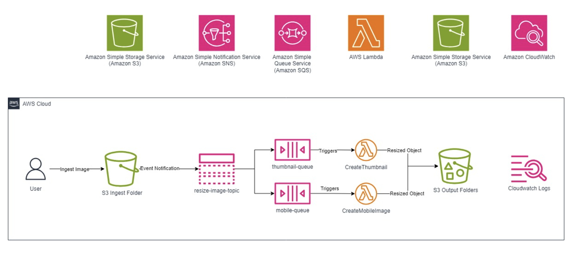
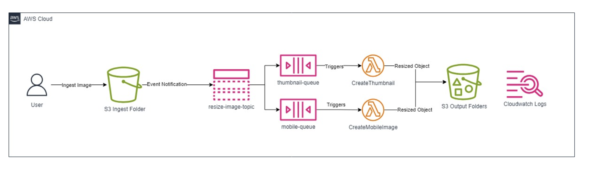

# Hands-on 4: Building a Serverless Architecture

NOTE: Complete this session in `ap-northeast-1`, namely `Tokyo`. Because `S3 links` in Part-4 
are available only in that region. If you decide to complete this session in another Region, you
need to upload `.zip` files manually in related parts. You can ask for help to your instructor.

OVERVIEW

AWS solutions architects increasingly adopt event-driven architectures to decouple distributed applications. 
Often, these events must be propagated in a strictly ordered way to all subscribed applications. Using Amazon 
Simple Notification Service (Amazon SNS) topics and Amazon Simple Queue Service (Amazon SQS) queues, you can 
address use cases that require end-to-end message ordering, deduplication, filtering, and encryption. Here, you 
configure an Amazon Simple Storage Service (Amazon S3) bucket to invoke an Amazon SNS notification whenever an 
object is added to an S3 bucket. You learn how to create and interact with SQS queues, and learn how to invoke 
an AWS Lambda function using Amazon SQS. This scenario will help you understand how you can architect your application 
to respond to Amazon S3 bucket events using serverless services such as Amazon SNS, AWS Lambda, and Amazon SQS.

By the end of this part, you should be able to do the following:

- Understand the value of decoupling resources.
- Understand the potential value of replacing Amazon Elastic Compute Cloud (Amazon EC2) instances with Lambda functions.
- Create an Amazon SNS topic.
- Create Amazon SQS queues.
- Create event notifications in Amazon S3.
- Create AWS Lambda functions using preexisting code.
- Invoke an AWS Lambda function from SQS queues.
- Monitor AWS Lambda S3 functions through Amazon CloudWatch Logs.



The scenario workflow is as follows:

1. You upload an image file to an Amazon S3 bucket.
2. Uploading a file to the ingest folder in the bucket invokes an event notification to an Amazon SNS topic.
3. Amazon SNS then distributes the notifications to separate SQS queues.
4. The Lambda functions process the images into formats and stores the output in S3 bucket folder.
5. You validate the processed images in the S3 bucket folders and the logs in Amazon CloudWatch.

## Task 1: Create a standard Amazon SNS topic

- At the top of the AWS Management Console, in the search box, search for and choose 'Simple Notification Service'.
- Expand the navigation menu by choosing the menu icon  in the upper-left corner.
- From the left navigation menu, choose 'Topics'. Choose 'Create topic'.
- On the 'Create topic' page, in the 'Details' section, configure the following:

```text
Type: Choose Standard.
Name: Enter a unique SNS topic name, such as resize-image-topic-, followed by four random numbers.
```

- Choose 'Create topic'. The topic is created and the resize-image-topic-XXXX page is displayed. The topic’s 
Name, Amazon Resource Name (ARN), (optional) Display name, and topic owner’s AWS account ID are displayed in 
the Details section. Copy the topic 'ARN' and 'Topic owner' values to a notepad.

## Task 2: Create two Amazon SQS queues

In this task, you create two Amazon SQS queues each for a specific purpose and then subscribe the queues to the 
previously created Amazon SNS topic.

### Task 2.1: Create an Amazon SQS queue for the thumbnail image

- At the top of the AWS Management Console, in the search box, search for and choose 'Simple Queue Service'.
- On the SQS home page, choose 'Create queue'. On the 'Create queue' page, in the 'Details' section, configure 
the following:

```text
Type: Standard 
Name: thumbnail-queue.
The console sets default values for the queue Configuration parameters. Leave the default values.
```

Choose 'Create queue'.

- On the queue’s detail page, choose the 'SNS subscriptions' tab. Choose 'Subscribe to Amazon SNS topic'.
- A new Subscribe to Amazon SNS topic page opens. From the Specify an 'Amazon SNS topic available for this 
queue' section, choose the 'resize-image-topic' SNS topic you created previously under 'Use existing resource'. 
Choose 'Save'.

### Task 2.2: Create an Amazon SQS queue for the mobile image

- On the SQS console, expand the navigation menu on the left, and choose 'Queues'. Choose 'Create queue'.
- On the 'Create queue' page, in the 'Details' section, configure the following:

```text
Type: Standard
Name: mobile-queue
The console sets default values for the queue Configuration parameters. Leave the default values.
```

Choose 'Create queue'.

- On the queue’s detail page, choose the 'SNS subscriptions' tab. Choose 'Subscribe to Amazon SNS topic'.
- From the 'Specify an Amazon SNS topic available for this queue' section, choose the 'resize-image-topic' SNS 
topic you created previously under 'Use existing resource'. Choose 'Save'.

### Task 2.3: Verifying the AWS SNS subscriptions

To verify the result of the subscriptions, publish to the topic and then view the message that the topic sends 
to the queue.

- At the top of the AWS Management Console, in the search box, search for and choose 'Simple Notification Service'.
- In the left navigation pane, choose 'Topics'. On the 'Topics' page, choose 'resize-image-topic-XXXX'.
- Choose 'Publish message'. The console opens the 'Publish message' to topic page.
- In the 'Message details' section, configure the following:

```text
Subject - optional:: Hello world.
```

- In the Message body section, configure the following:

```text
-> For 'Message structure', select 'Identical payload for all delivery protocols'.
-> For 'Message body sent to the endpoint', enter 'Testing Hello world' or any message of your choice.
```

In the Message attributes section, configure the following:

```text
For 'Type', choose String.
For 'Name', enter Message.
For 'Value', enter Hello World.
```

Choose 'Publish message'.

The message is published to the topic, and the console opens the topic’s detail page. To investigate the 
published message, navigate to Amazon SQS.

- At the top of the AWS Management Console, in the search box, search for and choose 'Simple Queue Service'.
- Choose any queue from the list.
- Choose 'Send and receive messages'.
- On 'Send and receive messages' page, in the 'Receive messages' section, choose 'Poll for messages'.
- Locate the Message section. Choose any ID link in the list to review the Details, Body, and Attributes of 
the message.

The Message Details box contains a JSON document that contains the subject and message that you published to 
the topic.

- Choose 'Done'.

## Task 3: Create an Amazon S3 event notification

In this task, you create an Amazon S3 Event Notification and receive S3 event notifications using the event 
notification destination as Amazon SNS when certain event happen in the S3 bucket.

### Task 3.1: Configure the Amazon SNS access policy to allow the Amazon S3 bucket to publish to a topic

- At the top of the AWS Management Console, in the search box, search for and choose 'Simple Notification Service'.
- From the left navigation menu, choose 'Topics'. Choose the 'resize-image-topic-XXXX' topic.
- Choose 'Edit'. Navigate to the 'Access policy - optional' section and expand it, if necessary.
- Delete the existing content of the JSON editor panel.
- Copy the following code block and paste it into the JSON Editor section.

```bash
{
  "Version": "2008-10-17",
  "Id": "__default_policy_ID",
  "Statement": [
    {
      "Sid": "__default_statement_ID",
      "Effect": "Allow",
      "Principal": {
        "AWS": "*"
      },
      "Action": [
        "SNS:GetTopicAttributes",
        "SNS:SetTopicAttributes",
        "SNS:AddPermission",
        "SNS:RemovePermission",
        "SNS:DeleteTopic",
        "SNS:Subscribe",
        "SNS:ListSubscriptionsByTopic",
        "SNS:Publish"
      ],
      "Resource": "SNS_TOPIC_ARN",
      "Condition": {
        "StringEquals": {
          "AWS:SourceAccount": "SNS_TOPIC_OWNER"
        }
      }
    },
    {
      "Effect": "Allow",
      "Principal": {
        "Service": "s3.amazonaws.com"
      },
      "Action": "SNS:Publish",
      "Resource": "SNS_TOPIC_ARN",
      "Condition": {
        "StringEquals": {
          "AWS:SourceAccount": "SNS_TOPIC_OWNER"
        }
      }
    }
  ]
}
```

- Replace the two occurrences of SNS_TOPIC_OWNER with the Topic owner (12-digit AWS Account ID) value that 
you copied earlier in Task 1. Make sure to leave the double quotes.
- Replace the two occurrences of SNS_TOPIC_ARN with the SNS topic ARN value copied earlier in Task 1. Make 
sure to leave the double quotes.
- Choose 'Save changes'.

### Task 3.2: Create a single S3 event notification on uploads to the ingest S3 bucket

- At the top of the AWS Management Console, search for 'S3'.
- On the left-hand of the console, choose 'Buckets' and click on 'Create bucket'.
- Give a bucket a specific name. Leave the rest as default and choose 'Create bucket' at the bottom of the 
screen. Notice that the name of the bucket is displayed among the list of all the buckets for the account.
- Choose the bucket and choose 'Create Folder' on the bucket page.
- Create a folder with the following settings.

```text
Folder name: ingest
Leave the rest as default.
```

Choose 'Create folder'.

- On the bucket bage, choose the 'Properties' tab. First, copy the 'ARN' of the bucket to notepad. Then, scroll 
to the 'Event notifications' section. Choose 'Create event notification'.
- In the 'General configuration' section, do the following:

```text
Event name: resize-image-event
Prefix - optional: ingest/

Note: In this hands-on, you set up a prefix filter so that you receive notifications only when files are added to 
a specific folder (ingest).

Suffix - optional: .jpg


Note: In this hands-on, you set up a suffix filter so that you receive notifications only when .jpg files are uploaded.
```

- In the 'Event types' section, select 'All object create events'.
- In the 'Destination' section, configure the following:

```text
Destination: SNS topic
Specify SNS topic: Choose from your SNS topics
SNS topic: resize-image-topic-XXXX
```

Choose 'Save changes'.

## Task 4: Create IAM Role and custom policies

- Type 'IAM' in the search bar and navigate to service page.
- From the left-hand side of the page, choose 'Roles'. Then, choose 'Create role'.
- Follow these settings: 

```text
Trusted entity type: AWS Service
Use case: Lambda
```

Click 'Next' and continue ...

Click 'Next' and continue ...

```text
Role Name: CustomExecutionRole
```

Note: The role is created without permissions. The policies will be added soon.

Click 'Create role'.

- After the role is created, choose this role. In the 'Permission policies' section, 
choose 'Add permissions -> Create inline policy'.
- On the 'Specify permissions page', follow these settings:

Policy editor: JSON

```bash
{
    "Version": "2012-10-17",
    "Statement": [
        {
            "Action": [
                "logs:CreateLogGroup",
                "logs:CreateLogStream",
                "logs:PutLogEvents"
            ],
            "Resource": "arn:aws:logs:*:*:*",
            "Effect": "Allow"
        }
    ]
}
```

This policy grants the permissions necessary for performing the specified actions (creating log groups, 
creating log streams, and adding log events) on any AWS resource related to CloudWatch Logs. This is 
typically used to enable an application or service to log information using CloudWatch Logs.

Choose 'Next' ...

```text
Policy Name: AWSLambda-CW
```

Choose 'Create Policy'

- Repeat this again. In the 'Permission policies' section, 
choose 'Add permissions -> Create inline policy'.
- On the 'Specify permissions page', follow these settings:

Policy editor: JSON

```bash
{
    "Version": "2012-10-17",
    "Statement": [
        {
            "Action": [
                "s3:PutObject",
                "s3:DeleteObject",
                "s3:List*"
            ],
            "Resource": [
                "BUCKET_ARN/*",
                "BUCKET_ARN"
            ],
            "Effect": "Allow"
        }
    ]
}
```

Note: Replace the BUCKET_ARN with the ARN value of the S3 Bucket you created earlier.

This policy allows a user or service to upload objects to, delete objects to or list the contents 
of the specified S3 bucket. It is useful for users or applications that need to manage files within 
a specific S3 bucket while ensuring that they have the necessary permissions to perform these actions.

Choose 'Next' ...

```text
Policy Name: AWSLambda-S3
```

Choose 'Create Policy'

- Type 'IAM' in the search bar and navigate to service page.
- From the left-hand side of the page, choose 'Roles'. Then, choose 'Create role'.
- Follow these settings: 

```text
Trusted entity type: AWS Service
Use case: Lambda
```

Click 'Next' and continue ...

```text
Policies : AmazonS3FullAccess, AmazonSQSFullAccess, AWSLambda_FullAccess
```

Click 'Next' and continue ...

```text
Role Name: LabExecutionRole
```

Click 'Create role'

- After the role is created, choose this role. In the 'Permission policies' section, 
choose 'Add permissions -> Create inline policy'.
- On the 'Specify permissions page', follow these settings:

Policy editor: JSON

```bash
{
    "Version": "2012-10-17",
    "Statement": [
        {
            "Action": [
                "logs:CreateLogGroup",
                "logs:CreateLogStream",
                "logs:PutLogEvents"
            ],
            "Resource": "arn:aws:logs:*:*:*",
            "Effect": "Allow"
        }
    ]
}
```

This policy grants the permissions necessary for performing the specified actions (creating log groups, 
creating log streams, and adding log events) on any AWS resource related to CloudWatch Logs. This is 
typically used to enable an application or service to log information using CloudWatch Logs.

Choose 'Next' ...

```text
Policy Name: CWLogsPolicy
```

Choose 'Create Policy'

## Task 5: Create and configure two AWS Lambda functions

In this task, you create two AWS Lambda functions and deploy the respective functionality code to each 
Lambda function by uploading code and configure each Lambda function to add an SQS trigger.

### Task 5.1: Create a Lambda function to generate a thumbnail image



In this task, you create an AWS Lambda function with an SQS trigger that reads an image from Amazon S3, 
resizes the image, and then stores the new image in an Amazon S3 bucket folder.

- At the top of the AWS Management Console, in the search box, search for and choose 'Lambda'.
- Choose 'Create function'. In the 'Create function' window, select 'Author from scratch'.
- In the Basic information section, configure the following:

```text
Function name: CreateThumbnail
Runtime: Python 3.9
Expand the Change default execution role section.
Execution role: Use an existing role.
Existing role: LabExecutionRole
This role provides your Lambda function with the permissions it needs to access Amazon S3 and Amazon SQS.
```

Caution: Make sure to choose Python 3.9 under Other supported runtime. If you choose Python 3.10 or the 
Latest supported, the code fails as it is configured specifically for Python 3.9.

- Choose Create function. At the top of the page there is a message like, Successfully created the function 
CreateThumbnail. You can now change its code and configuration. To invoke your function with a test event, 
choose “Test”.

### Task 5.2: Configure the CreateThumbnail Lambda function to add an SQS trigger and upload the Python deployment package

You initiate the Lambda function whenever a new object is pushed to your Amazon SQS queue.

Choose 'Add trigger', and then configure the following:

```text
-> For 'Select a source', choose 'SQS'.
-> For 'SQS Queue', choose 'thumbnail-queue'.
-> For 'Batch size - optional', enter '1'.
```

- Scroll to the bottom of the page, and then choose 'Add'.

At the top of the page there is a message like, The trigger thumbnail-queue was successfully added to function 
CreateThumbnail. The trigger is in a disabled state.

The SQS trigger is added to your Function overview page. Now configure the Lambda function.

- Choose the 'Code' tab.

Configure the following settings (and ignore any settings that are not listed):

Choose Upload from, and choose Amazon S3 location.

```text
S3-link: s3://hepapi-aws-session-files/Session4-Serverless/CreateThumbnail.zip
```

Choose 'Save'

Examine the 'CreateThumbnail.py' code. It is performing the following steps:

1. Receives an event, which contains the name of the incoming object (Bucket, Key)
2. Downloads the image to local storage
3. Resizes the image using the Pillow library
4. Creates and uploads the resized image to a new folder

- In the Runtime settings section, choose Edit. 

-> For Handler, enter 'CreateThumbnail.handler'. 

Choose 'Save'.

At the top of the page there is a message like, Successfully updated the function CreateThumbnail.

Caution: Make sure you set the Handler field to the preceding value, otherwise the Lambda function will 
not be found.

- Choose the Configuration tab. From the left navigation menu, choose 'General configuration'. Choose 'Edit'.

-> For Description, enter 'Create a thumbnail-sized image'.

Leave the other settings at the default settings. Here is a brief explanation of these settings:

Memory defines the resources that are allocated to your function. Increasing memory also increases CPU allocated 
to the function. Timeout sets the maximum duration for function processing.

Choose 'Save'.

The CreateThumbnail Lambda function has now been configured.

### Task 5.3: Create a Lambda function to generate a mobile image

In this task, you create an AWS Lambda function with an SQS trigger that reads an image from Amazon S3, resizes 
the image, and then stores the new image in an Amazon S3 bucket folder.

- At the top of the AWS Management Console, in the search box, search for and choose 'Lambda'.
- Choose 'Create function'. In the 'Create function' window, select 'Author from scratch'.
- In the Basic information section, configure the following:

```text
Function name: CreateMobileImage
Runtime: Python 3.9
Expand the Change default execution role section.
Execution role: Use an existing role.
Existing role: LabExecutionRole
This role provides your Lambda function with the permissions it needs to access Amazon S3 and Amazon SQS.
```

Caution: Make sure to choose Python 3.9 under Other supported runtime. If you choose Python 3.10 or the Latest
supported, the code fails as it is configured specifically for Python 3.9.

- Choose Create function. At the top of the page there is a message like, Successfully created the function 
CreateMobileImage. You can now change its code and configuration. To invoke your function with a test event, choose “Test”.

### Task 5.4: Configure the CreateMobileImage Lambda function to add an SQS trigger and upload the Python deployment package

You initiate the Lambda function whenever a new object is pushed to your Amazon SQS queue.

Choose 'Add trigger', and then configure the following:

```text
-> For 'Select a source', choose 'SQS'.
-> For 'SQS Queue', choose 'mobile-queue'.
-> For 'Batch size - optional', enter '1'.
```

- Scroll to the bottom of the page, and then choose 'Add'.

At the top of the page there is a message like, The trigger thumbnail-queue was successfully added to function 
CreateMobileImage. The trigger is in a disabled state.

The SQS trigger is added to your Function overview page. Now configure the Lambda function.

- Choose the 'Code' tab.

Configure the following settings (and ignore any settings that are not listed):

Choose Upload from, and choose Amazon S3 location.

```text
S3-link: s3://hepapi-aws-session-files/Session4-Serverless/CreateMobileImage.zip
```

Choose 'Save'

Examine the 'CreateMobileImage.py' code. It is performing the following steps:

1. Receives an event, which contains the name of the incoming object (Bucket, Key)
2. Downloads the image to local storage
3. Resizes the image using the Pillow library
4. Creates and uploads the resized image to a new folder

- In the Runtime settings section, choose Edit. 

-> For Handler, enter 'CreateMobileImage.handler'. 

Choose 'Save'.

At the top of the page there is a message like, Successfully updated the function CreateMobileImage.

Caution: Make sure you set the Handler field to the preceding value, otherwise the Lambda function will not 
be found.

- Choose the Configuration tab. From the left navigation menu, choose 'General configuration'. Choose 'Edit'.

-> For Description, enter 'Create a mobile friendly image'.

Leave the other settings at the default settings. Here is a brief explanation of these settings:

Memory defines the resources that are allocated to your function. Increasing memory also increases CPU allocated 
to the function. Timeout sets the maximum duration for function processing.

Choose 'Save'.

The CreateMobileImage Lambda function has now been configured.

## Task 6: Upload an object to an Amazon S3 bucket

### Task 6.1: Upload an image to the S3 bucket folder for processing

- You can find 'HappyFace.jpg' file in this folder.
- At the top of the AWS Management Console, in the search box, search for and choose 'S3'.
- In the 'S3 Management Console', choose the bucket you created. Choose the 'ingest/' link. Choose 'Upload'.
- In the Upload window, choose Add files. Browse to and choose the HappyFace.jpg picture you downloaded.
- Choose 'Upload'.

## Task 7: Validate the processed file

In this task, you validate the processed file from the logs generated by the function code through Amazon 
CloudWatch Logs.

### Task 7.1: Review Amazon CloudWatch Logs for Lambda activity

You can monitor AWS Lambda functions to identify problems and view log files to assist in debugging.

- At the top of the AWS Management Console, in the search box, search for and choose 'Lambda'.
- Choose the hyperlink for one of your 'Create-' functions. Choose the 'Monitor' tab.
- The console displays graphs showing the following:

Invocations: The number of times that the function was invoked.
Duration: The average, minimum, and maximum execution times.
Error count and success rate (%): The number of errors and the percentage of executions that completed 
without error.
Throttles: When too many functions are invoked simultaneously, they are throttled. The default is 1000 
concurrent executions.
Async delivery failures: The number of errors that occurred when Lambda attempted to write to a destination 
or dead-letter queue.
Iterator Age: Measures the age of the last record processed from streaming triggers (Amazon Kinesis and 
Amazon DynamoDB Streams).
Concurrent executions: The number of function instances that are processing events.
Log messages from Lambda functions are retained in Amazon CloudWatch Logs.

- Choose 'View CloudWatch logs'
- Choose the hyperlink for the newest Log stream that appears
- Expand each message to view the log message details.

The REPORT line provides the following details:

RequestId: The unique request ID for the invocation
Duration: The amount of time that your function’s handler method spent processing the event
Billed Duration: The amount of time billed for the invocation
Memory Size: The amount of memory allocated to the function
Max Memory Used: The amount of memory used by the function
Init Duration: For the first request served, the amount of time it took the runtime to load the function and 
run code outside of the handler method
In addition, the logs display any logging messages or print statements from the functions. This assists in 
debugging Lambda functions.

Note: Reviewing the logs you may notice that the Lambda function has been executed multiple times. This is 
because the Lambda function is receiving the test message posted to the SNS topic previously. Another one of 
logs was generated when the event notifications for your S3 bucket was created. The third log was generated 
when an object was uploaded the S3 bucket, and triggered the functions.

### Task 7.2: Validate the S3 bucket for processed files

- At the top of the AWS Management Console, in the search box, search for and choose 'S3'.
- Choose the bucket you created. Navigate through these folders to find the resized images.
- If you find the resized image here, you have successfully resized the image from its original to different 
formats.

## (Optional) Task 8: Create a lifecycle configuration to delete files in the ingest bucket after 30 days.

- At the top of the AWS Management Console, in the search box, search for and choose 'S3'.
- On the Buckets page, choose the bucket you created. Choose the 'Management' tab.
- In the 'Lifecycle rules' section, choose 'Create lifecycle rule'.
- In the 'Lifecycle rule configuration' section, configure the following:

```text
Lifecycle rule name: cleanup
Choose a rule scope: Limit the scope of this rule using one or more filters.
```

- In the 'Filter type' section, configure the following:

```text
Prefix: Enter ingest/.
```

In the 'Lifecycle rule actions' section, configure the following:

```text
Select 'Expire current versions of objects' and  'Permanently delete noncurrent versions of objects'.
```

Enter the following values in the new boxes that open.

```text
Days after object creation: 30.
Days after objects become noncurrent: 1
```

Choose 'Create rule'.

## (Optional) Task 9: Add an SNS email notification to the existing SNS topic.

- At the top of the AWS Management Console, in the search box, search for and choose 'Simple Notification Service'.
- In the left navigation pane, choose 'Subscriptions'.
- On the 'Subscriptions' page, choose 'Create subscription'.
- On the 'Create subscription' page, in the 'Details' section, configure the following:

```text
Topic ARN: Choose the ARN of the topic created
Protocol: Email
Endpoint: Enter an email address.
```

Choose 'Create subscription'.

Note: The console creates the subscription and opens the subscription’s Details page. You must confirm the subscription 
before the email address can start to receive messages.

- To confirm a subscription, check your email inbox and choose 'Confirm subscription' in the email from Amazon SNS.
- Amazon SNS opens your web browser and displays a subscription confirmation with your subscription ID.
