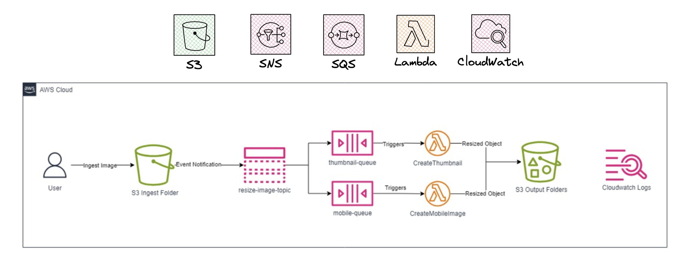

# Session-11: Serverless

The purpose of this session is to implement AWS messaging and automation by configuring SNS for 
notifications, setting up SQS for asynchronous messaging, enabling S3 event notifications, and 
creating and testing Lambda functions.

- Part 1: Simple Notification Service (SNS)
   - Configuring notifications
- Part 2: Simple Queue Service (SQS)
   - Setting up queues for asynchronous messaging
- Part 3: S3 Event Notifications
   - Configuring event notifications for S3
- Part 4: Lambda Functions
   - Creating and testing Lambda functions

NOTE-1: If you do this session using an IAM-User under an organization account, you should attach
`-<Your-Name>` at the end of the each resource name. This would avoid confusion between IAM-Users 
because the resources would be created under one account, namely `Management Account`.

Example: If the resource name is `aws-training-billing-alarm`, which is a CloudWatch alarm name; 
make it `aws-training-billing-alarm-john` so that you now that you created this resource.

NOTE-2: Complete this session in `ap-northeast-1`, namely `Tokyo`. Because `S3 links` in Part-4 
are available only in that region. If you decide to complete this session in another Region, you
need to upload `.zip` files manually in related parts. You can ask for help to your instructor.



## Part 1: Simple Notification Service (SNS)

- Note that the link for Lambda Functions are available in `ap-northeast-1` region. To use the links,
you should complete the hands-on in `ap-northeast-1`. However, you can upload the functions manually, too.
The necessary files are located under `/files` in `.zip` format.

### Configuring notifications

- Go to `Simple Notification Service` from the AWS Management Console.

- From the left navigation menu, choose `Topics`. Choose `Create topic`.

```text
Type: Standard
Name: Enter a unique SNS topic name, such as resize-image-topic-xxxxx
```

- Change `xxxxx` with random numbers. Then, choose `Create topic`.

- Copy the `Topic ARN` and `Topic owner` values to a notepad.

## Part 2: Simple Queue Service (SQS)

### Setting up queues for asynchronous messaging

- Go to `Simple Queue Service` from the AWS Management Console.

- On the SQS home page, choose `Create queue`.

```text
Type: Standard 
Name: thumbnail-queue
Leave the rest as default
```

- Choose `Create queue`.

- On the queue’s detail page, choose the `SNS subscriptions` tab. Choose `Subscribe to Amazon SNS topic`.

- From the `Amazon SNS topic available for this queue` section, choose the SNS topic you created under 
`Use existing resource`. 

- Choose `Save`.

- Go to `SQS`. Choose `Queues`. Choose `Create queue`.

```text
Type: Standard
Name: mobile-queue
Leave the rest as default
```

- Choose `Create queue`.

- On the queue’s detail page, choose the `SNS subscriptions` tab. Choose `Subscribe to Amazon SNS topic`.

- From the `Amazon SNS topic available for this queue` section, choose the SNS topic you created under 
`Use existing resource`. 

- Go to `SNS`. From the menu on the left, choose `Topics`. Then, choose the topic you created.

- Choose `Publish message`. The console opens the `Publish message` to topic page.

- In the `Message details` section, configure the following:

```text
Subject - optional: Hello world
```

- In the `Message body` section, configure the following:

```text
Message structure: Identical payload for all delivery protocols
Message body sent to the endpoint: 'Testing Hello world' or any message of your choice.
```

- In the `Message attributes` section, configure the following:

```text
Type: String
Name: Message
Value: Hello World
```

- Choose `Publish message`.

- Go to `SQS`.

- Choose any queue from the list. Then, choose `Send and receive messages`.

- On the `Send and receive messages` page, choose `Poll for messages` under `Receive messages` section.

- Locate the `Message` section. Choose any `ID link` in the list to review.

- Choose `Done`.

## Part 3: S3 Event Notifications

### Configuring event notifications for S3

- Go to `SNS`. From the menu on the left, choose `Topics`. Then, choose the topic you created.

- Choose `Edit`. Navigate to the `Access policy - optional` section and expand it, if necessary.

- Delete the existing content of the `JSON editor` section.

- Copy the following code block and paste it into the `JSON editor` section.

```bash
{
  "Version": "2008-10-17",
  "Id": "__default_policy_ID",
  "Statement": [
    {
      "Sid": "__default_statement_ID",
      "Effect": "Allow",
      "Principal": {
        "AWS": "*"
      },
      "Action": [
        "SNS:GetTopicAttributes",
        "SNS:SetTopicAttributes",
        "SNS:AddPermission",
        "SNS:RemovePermission",
        "SNS:DeleteTopic",
        "SNS:Subscribe",
        "SNS:ListSubscriptionsByTopic",
        "SNS:Publish"
      ],
      "Resource": "SNS_TOPIC_ARN",
      "Condition": {
        "StringEquals": {
          "AWS:SourceAccount": "SNS_TOPIC_OWNER"
        }
      }
    },
    {
      "Effect": "Allow",
      "Principal": {
        "Service": "s3.amazonaws.com"
      },
      "Action": "SNS:Publish",
      "Resource": "SNS_TOPIC_ARN",
      "Condition": {
        "StringEquals": {
          "AWS:SourceAccount": "SNS_TOPIC_OWNER"
        }
      }
    }
  ]
}
```

- Replace the two occurrences of `SNS_TOPIC_OWNER` with the `Topic owner (12-digit AWS Account ID)` value 
that you copied earlier. Make sure to leave the double quotes.

- Replace the two occurrences of `SNS_TOPIC_ARN` with the `SNS topic ARN` value that you copied earlier. 
Make sure to leave the double quotes.

- Choose `Save changes`.

- Go to `S3`. From the menu on the left, choose `Buckets`. Then, choose `Create bucket`.

```text
Bucket name: test-bucket-for-session-xxxxx
Leave the rest as default.
```

- To give a bucket a specific name, change `xxxxx` as required. 

- Then, choose `Create bucket`. 

- Choose the bucket and choose `Create Folder` on the bucket page.

```text
Folder name: ingest
Leave the rest as default.
```

- Choose `Create folder`.

- On the bucket bage, choose the `Properties` section. Copy the `Bucket ARN` to notepad.

- Then, scroll down to the `Event notifications` part . Choose `Create event notification`.

- In the `General configuration` section, do the following:

```text
Event name: resize-image-event
Prefix - optional: ingest/
A prefix filter to receive notifications only when files are added to 'ingest' folder
Suffix - optional: .jpg
A suffix filter to receive notifications only when '.jpg' files are uploaded.
```

- In the `Event types` section, select `All object create events`.

- In the `Destination` section, configure the following:

```text
Destination: SNS topic
Specify SNS topic: Choose from your SNS topics
SNS topic: resize-image-topic-xxxxx
```

- Choose `Save changes`.

- Go to `IAM`. From the menu on the left, choose `Roles`. Then, choose `Create Role`.

```text
Trusted entity type: AWS Service
Use case: Lambda
```

- Click `Next` and continue ...

- Click `Next` and continue ...

```text
Role name: CustomExecutionRole
```

- The role is created without permissions. The policies will be added soon.

- Click `Create role`.

- After the role is created, choose this role. 

- In the `Permission policies` section, choose `Add permissions -> Create inline policy`.

- On the `Specify permissions` page, follow these settings:

Policy editor: JSON

```bash
{
    "Version": "2012-10-17",
    "Statement": [
        {
            "Action": [
                "logs:CreateLogGroup",
                "logs:CreateLogStream",
                "logs:PutLogEvents"
            ],
            "Resource": "arn:aws:logs:*:*:*",
            "Effect": "Allow"
        }
    ]
}
```

- Choose `Next` ...

```text
Policy Name: AWSLambda-CW
```

- Choose `Create Policy`.

- Repeat this again. Choose `Add permissions -> Create inline policy`.

- On the `Specify permissions` page, follow these settings:

Policy editor: JSON

```bash
{
    "Version": "2012-10-17",
    "Statement": [
        {
            "Action": [
                "s3:PutObject",
                "s3:DeleteObject",
                "s3:List*"
            ],
            "Resource": [
                "BUCKET_ARN/*",
                "BUCKET_ARN"
            ],
            "Effect": "Allow"
        }
    ]
}
```

- Replace the `BUCKET_ARN` with the ARN value of the S3 Bucket you created earlier.

- Choose `Next` ...

```text
Policy Name: AWSLambda-S3
```

- Choose `Create Policy`.

- Go to `IAM`. From the menu on the left, choose `Roles`. Then, choose `Create role`.

```text
Trusted entity type: AWS Service
Use case: Lambda
```

- Click `Next` and continue ...

```text
Policies : AmazonS3FullAccess, AmazonSQSFullAccess, AWSLambda_FullAccess
```

- Click `Next` and continue ...

```text
Role Name: LabExecutionRole
```

- Click `Create role`.

- After the role is created, choose this role. 

- In the `Permission policies` section, choose `Add permissions -> Create inline policy`.

- On the `Specify permissions` page, follow these settings:

Policy editor: JSON

```bash
{
    "Version": "2012-10-17",
    "Statement": [
        {
            "Action": [
                "logs:CreateLogGroup",
                "logs:CreateLogStream",
                "logs:PutLogEvents"
            ],
            "Resource": "arn:aws:logs:*:*:*",
            "Effect": "Allow"
        }
    ]
}
```

- Choose `Next` ...

```text
Policy Name: CWLogsPolicy
```

- Choose `Create Policy`.

## Part 4: Lambda functions

### Creating and testing Lambda functions

- Go to `Lambda`. Choose `Create function`. 

- In the `Create function` window, select `Author from scratch`.

- In the `Basic information` section, configure the following:

```text
Function name: CreateThumbnail
Runtime: Python 3.9
Expand the Change default execution role section.
Execution role: Use an existing role
Existing role: LabExecutionRole
```

Caution: Make sure to choose Python 3.9 under Other supported runtime. If you choose Python 3.10 or 
the Latest supported, the code fails as it is configured specifically for Python 3.9.

- Choose `Create function`. 

- To invoke your function with a test event, choose `Test`.

- Choose `Add trigger`, and then configure the following:

```text
Select a source: SQS
SQS Queue: thumbnail-queue
Batch size - optional: 1
```

- Scroll down to the bottom of the page, and then choose `Add`.

- The `SQS trigger` is added to your `Function overview` page.

- Choose the `Code` tab.

- Choose `Upload from`, then choose `Amazon S3 location`.

```text
S3-link: https://hepapi-aws-session-files.s3.ap-northeast-1.amazonaws.com/Session4-Serverless/CreateThumbnail.zip
```

- Alternatively, choose `Upload from` and choose `.zip file`.

- The zip file is located under `/files` path.

- Choose `Save`.

- Examine the `CreateThumbnail.py` code. It is performing the following steps:

1. Receives an event, which contains the name of the incoming object (Bucket, Key).
2. Downloads the image to local storage.
3. Resizes the image using the Pillow library.
4. Creates and uploads the resized image to a new folder.

- In the `Runtime settings` section, choose `Edit`. 

- For `Handler`, enter `CreateThumbnail.handler`. 

- Choose `Save`.

Caution: Make sure you set the Handler field to the preceding value, otherwise the Lambda function 
will not be found.

- Choose the `Configuration` section. From the menu on the left, choose `General configuration`. Then, 
choose `Edit`.

- For `Description`, enter `Create a thumbnail-sized image`.

- Leave the rest as default. Choose `Save`.

- Go to `Lambda`. Choose `Create function`. 

- In the `Create function` window, select `Author from scratch`.

- In the `Basic information` section, configure the following:

```text
Function name: CreateMobileImage
Runtime: Python 3.9
Expand the Change default execution role section.
Execution role: Use an existing role.
Existing role: LabExecutionRole
```

Caution: Make sure to choose Python 3.9 under Other supported runtime. If you choose Python 3.10 or 
the Latest supported, the code fails as it is configured specifically for Python 3.9.

- Choose `Create function`.

- To invoke your function with a test event, choose `Test`.

- Choose `Add trigger`, and then configure the following:

```text
Select a source: SQS
SQS Queue: mobile-queue
Batch size - optional: 1
```

- Scroll down to the bottom of the page, and then choose `Add`.

- The `SQS trigger` is added to your `Function overview` page.

- Choose the `Code`.

- Choose `Upload from`, and choose `Amazon S3 location`.

```text
S3-link: https://hepapi-aws-session-files.s3.ap-northeast-1.amazonaws.com/Session4-Serverless/CreateMobileImage.zip
```

- Alternatively, choose `Upload from` and choose `.zip file`.

- The zip file is located under `/files` path.

- Choose `Save`.

- Examine the `CreateMobileImage.py` code. It is performing the following steps:

1. Receives an event, which contains the name of the incoming object (Bucket, Key).
2. Downloads the image to local storage.
3. Resizes the image using the Pillow library.
4. Creates and uploads the resized image to a new folder.

- In the `Runtime settings` section, choose `Edit`. 

- For `Handler`, enter `CreateMobileImage.handler`. 

- Choose `Save`.

Caution: Make sure you set the Handler field to the preceding value, otherwise the Lambda function 
will not be found.

- Choose the `Configuration` section. From the menu on the left, choose `General configuration`. Then, 
choose `Edit`.

- For `Description`, enter `Create a mobile friendly image`.

- Leave the rest as default. Choose `Save`.

- You can find `HappyFace.jpg` file under `/pics` folder.

- Go to `S3`. From the menu on the left, choose `Buckets`. Choose the bucket you created.

- Choose the `ingest/`. Choose `Upload`.

- In the `Upload` window, choose `Add files`. Browse to and choose the `HappyFace.jpg`.

- Choose `Upload`.

- Go to `Lambda`. Choose `Functions` from the menu on the left.

- Choose the hyperlink for one of your `Create-` functions. Choose the `Monitor` section.

- Choose `View CloudWatch logs`.

- Choose the hyperlink for the newest `Log stream` that appears.

- Expand each message to view the log message details.

- Go to `S3`. From the menu on the left, choose `Buckets`. Choose the bucket you created. 

- Navigate through the folders to find the resized images.

- If you find the resized images here, the functions have been triggered successfully.

- Go to `S3`. From the menu on the left, choose `Buckets`. Choose the bucket you created.

- Choose the `Management` section.

- In the `Lifecycle rules` part, choose `Create lifecycle rule'`.

- In the `Lifecycle rule configuration` section, configure the following:

```text
Lifecycle rule name: cleanup
Choose a rule scope: Limit the scope of this rule using one or more filters
```

- In the `Filter type` section, configure the following:

```text
Prefix: ingest/
```

- In the `Lifecycle rule actions` section, configure the following:

```text
(Checked) 'Expire current versions of objects', 'Permanently delete noncurrent versions of objects'
```

- Enter the following values in the newly opened boxes.

```text
Days after object creation: 30
Days after objects become noncurrent: 1
```

- Choose `Create rule`.

- Go to `SNS`. From the menu on the left, choose `Subscriptions`. Then, choose `Create subscription`.

```text
Topic ARN: Choose the ARN of the topic created
Protocol: Email
Endpoint: Enter an email address
```

- Choose 'Create subscription'.

- You must confirm the subscription before the email address can start to receive messages.

- To confirm a subscription, check your email inbox and choose `Confirm subscription` in the email 
from `Amazon SNS`.

- `Amazon SNS` opens your web browser and displays a subscription confirmation with your `Subscription ID`.

- Don't forget to destroy the resources you created.
