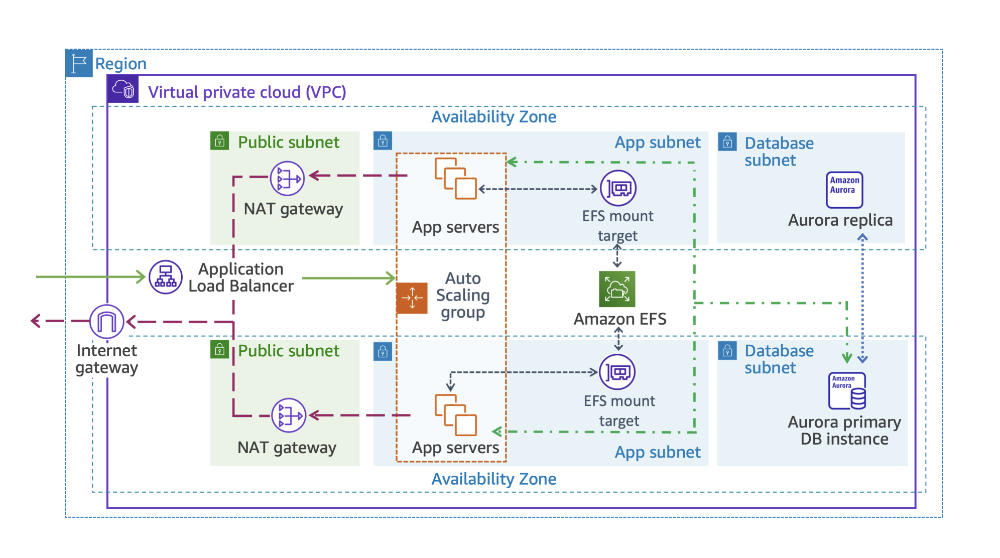
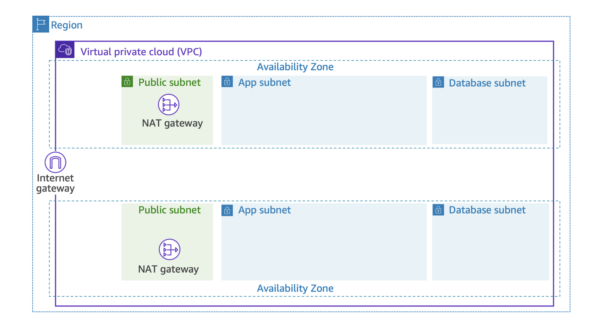
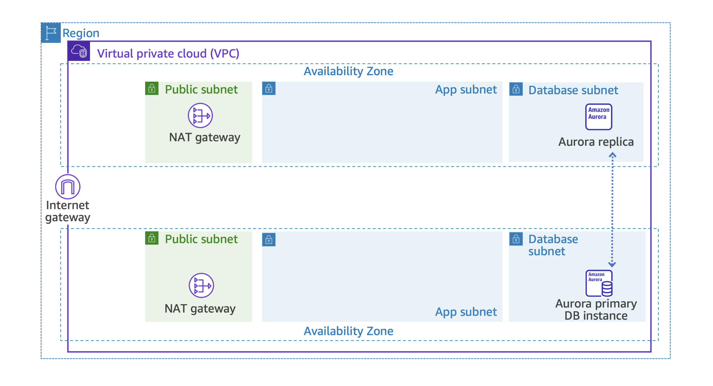
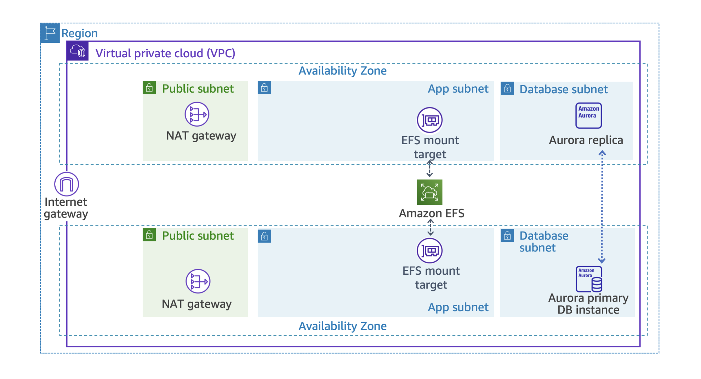
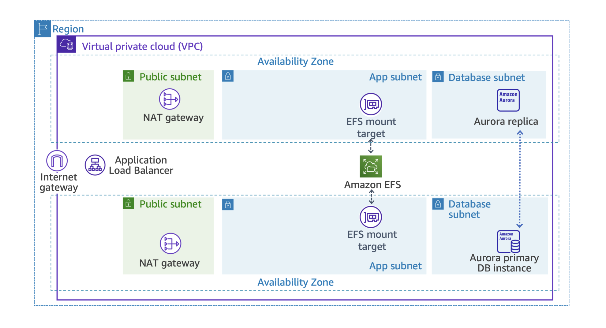
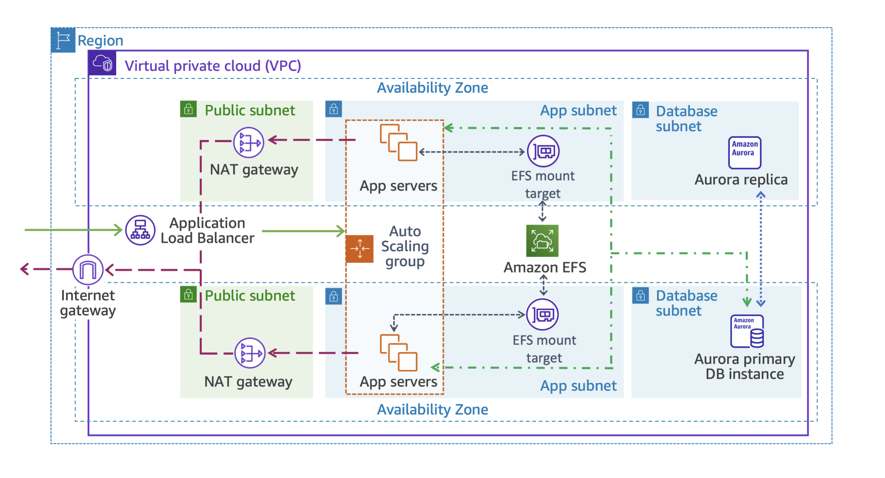

# Session-13: Capstone Project

Example Corp. creates marketing campaigns for small and medium-sized businesses. They currently host
their client-facing web portal (built on WordPress) in an on-premises data center and want to move it
to AWS. In this hands-on, you build a highly available, scalable architecture for this portal by
combining everything you learned in the previous sessions: a multi-AZ VPC, a managed database, shared
storage, a load balancer, and auto scaling.



After completing this hands-on, you should know how to do the following:

- Deploy a multi-AZ VPC using a CloudFormation template
- Create a highly available Amazon Aurora (MySQL-compatible) database with Amazon RDS
- Create a shared Amazon EFS file system for a multi-AZ application tier
- Create an Application Load Balancer and target group
- Deploy an EC2 launch template with CloudFormation
- Create an Auto Scaling group with a target tracking scaling policy
- Deploy and test a WordPress site on the architecture you built

> Replace `<YourName>` with your own name/initials (letters and numbers only, no spaces) in every
> resource name and parameter below, so that your resources can be told apart from other students'
> resources in the shared account.
>
> Work in a single AWS Region for this whole project (for example `us-east-1`). Check the region
> selector in the top-right corner of the console before every task.
>
> Task 1's CloudFormation stack is named `VPCStack-<YourName>` — that is the stack name, not the
> resource names inside it. The VPC it creates is named `LabVPC-<YourName>`, its subnets are named
> `PublicSubnet1-<YourName>`, `PublicSubnet2-<YourName>`, `AppSubnet1-<YourName>`,
> `AppSubnet2-<YourName>`, and its security groups are named `AppInstanceSecurityGroup-<YourName>`,
> `RDSSecurityGroup-<YourName>`, and `EFSMountTargetSecurityGroup-<YourName>`. Later tasks ask you
> to pick these by their resource name, not the stack name.
>
> AWS also appends its own random ID text after a security group's name in dropdowns (for example
> `RDSSecurityGroup-<YourName>-1AB2CD3E4F5G`) — that extra text is normal, just match the name in
> front of it.


## Task 1: Deploy the network with CloudFormation

In this task, you deploy the VPC, subnets, internet gateway, NAT gateways, route tables, and
security groups that the rest of the architecture will use. Instead of clicking through the VPC
console, you deploy a ready-made CloudFormation template.

- Locate [`hands-on/Task1.yaml`](hands-on/Task1.yaml) in this repository on your computer (if you
  are viewing this on GitHub, download it first).
- Type `CloudFormation` in the search bar and choose it.
- Choose `Create stack` and `With new resources (standard)`.
- Follow these settings:

```text
Prerequisite - Prepare template : Choose an existing template
Specify template                : Upload a template file
                                  Upload 'Task1.yaml'
```

- Choose `Next` and follow these settings:

```text
Stack name          : VPCStack-<YourName>
Parameters
  StudentName       : <YourName>
  (leave every other parameter at its default value)
```

> Remember the exact value you type for `StudentName` — you must enter the same value again in
> Task 5.

- Choose `Next` twice (leave `Configure stack options` at its defaults), then choose `Submit`.
- Wait for the stack status to change from `CREATE_IN_PROGRESS` to `CREATE_COMPLETE`. This can take
  up to 5 minutes.

> If the stack status changes to `ROLLBACK_COMPLETE` or `CREATE_FAILED` instead, someone else in
> the shared account has likely already used the same `StudentName` (or you mistyped it). Delete
> the failed stack, pick a different `StudentName` value, and create the stack again.



- Once the stack is complete, review what was created:
  - Choose the `Resources` tab to see the VPC, 2 public subnets, 2 app subnets, 2 database subnets,
    internet gateway, 2 NAT gateways, route tables, and 3 security groups that were created.
  - Choose the `Outputs` tab and keep this browser tab open — you will not need to copy these values
    manually, but it's useful to see what is available (subnet IDs and security group IDs).

Some AWS dropdowns only show a subnet's ID, CIDR block, and Availability Zone — not its Name tag. If
you don't see a Name column when picking a subnet in a later task, use this table to match it by CIDR
block instead:

| Subnet Name (yours has the `-<YourName>` suffix)   | CIDR block   | Availability Zone  |
|--------------------------------------------------- |--------------|--------------------|
| `PublicSubnet1`                                    | 10.0.0.0/24  | ends in `a`        |
| `PublicSubnet2`                                    | 10.0.1.0/24  | ends in `b`        |
| `AppSubnet1`                                       | 10.0.2.0/24  | ends in `a`        |
| `AppSubnet2`                                       | 10.0.3.0/24  | ends in `b`        |
| `DatabaseSubnet1`                                  | 10.0.4.0/24  | ends in `a`        |
| `DatabaseSubnet2`                                  | 10.0.5.0/24  | ends in `b`        |


## Task 2: Create an Amazon RDS (Aurora) database

In this task, you create the managed database layer for WordPress.

### Step 1: Create a DB subnet group

- Type `RDS` in the search bar and choose it.
- In the left navigation pane, choose `Subnet groups` and`Create DB subnet group`  .
- Follow these settings:

```text
Name        : AuroraSubnetGroup-<YourName>
Description : Subnet group for the capstone database
VPC         : LabVPC-<YourName> (the VPC created in Task 1)
```

- In `Add subnets`, configure:

```text
Availability Zones : Select the AZ ending in 'a' and the AZ ending in 'b'
Subnets            : Select the subnet with CIDR 10.0.4.0/24 (AZ 'a')
                      Select the subnet with CIDR 10.0.5.0/24 (AZ 'b')
```

- Choose `Create`.

### Step 2: Create the Aurora database

- In the left navigation pane, choose `Databases`, `Create database` and `Full configuration`.
- In `Engine options`, choose:

```text
Engine type : Aurora (MySQL Compatible)
```

- In `Choose a database creation method`, choose `Full configuration`.
- In `Templates`, choose:

```text
Templates : Production
```

- In `Cluster scalability type`, choose `Provisioned`. Under `Type of provisioned configuration`,
  choose:

```text
Type of provisioned configuration : Burstable classes (includes t classes)
DB instance class                 : db.t3.medium
```

- In `Settings`, set:

```text
DB cluster identifier : MyDBCluster-<YourName>
```

> Leave `Engine version` at its default. If you see the error "Selecting this option is required
> for the engine version you chose" under `Enable RDS Extended Support`, check that box to proceed
> — extended support charges only start once you keep the database running past that version's
> standard-support end date, well past the length of this lab.

- In `Credentials Settings`, set:

```text
Master username          : admin
Master password           : <a password you will remember> (Hepapi123!)
Confirm master password   : <the same password>
```

> Password rules: 8-41 characters; do not use `/`, `@`, `"`, or spaces.

- In `Cluster storage configuration`, leave `Aurora Standard` selected.
- In `Availability & durability`, select `Create an Aurora Replica or Reader node in a different AZ
  (recommended for scaled availability)`.
- In `Connectivity`, configure:

```text
Compute resource               : Don't connect to an EC2 compute resource
VPC                            : LabVPC-<YourName>
DB subnet group                : AuroraSubnetGroup-<YourName>
Public access                  : No
VPC security group (firewall)  : Choose existing
                                  Select 'RDSSecurityGroup-<YourName>' only, remove 'default' if present
```

- Leave `RDS Proxy` and `Certificate authority` at their defaults.
- Skip `Tags` — no tags needed here.
- In `Monitoring`, leave `Database Insights - Standard` selected and leave `Enable Enhanced
  Monitoring` unchecked.
- Expand `Additional configuration` and set:

```text
Initial database name : WPDatabase
```

- Leave `DB cluster parameter group`, `DB parameter group`, `Failover priority`, and the `Backup`
  settings at their defaults.
- Under `Encryption`, choose:

```text
Encryption key : AWS owned KMS key (SSE-RDS)
```

- Leave `Enable Backtrack` unchecked.
- In `Maintenance`, uncheck both boxes:

```text
[ ] Enable auto minor version upgrade
[ ] Enable deletion protection
```

> Leaving `Enable deletion protection` checked will block you from deleting this database in
> Task 7's cleanup, so make sure it's unchecked.

- Choose `Create database`. On the add-ons pop-up, choose `Close`.
- Wait for the status of `mydbcluster-<yourname>` to change to `Available`. This can take up to 5
  minutes; you don't need to wait for the individual instances.



### Step 3: Note down the connection details

- Choose the `MyDBCluster-<YourName>` cluster, then the `Connectivity & security` tab.
- In the `Endpoints` section, find the row whose `Role` is `Writer` — this is the cluster's writer
  (cluster) endpoint, the one the application connects to. Copy its `Endpoint` value somewhere safe.
- Note down your master username and password as well.

You will need the endpoint, username, password, and database name (`WPDatabase`) in Task 5.


## Task 3: Create an Amazon EFS file system

In this task, you create a shared file system so that every web server in your Auto Scaling group
serves the same WordPress files.

- Type `EFS` in the search bar and choose it.
- Choose `Create file system`. In the pop-up, set:

```text
Name : myWPEFS-<YourName>
VPC  : LabVPC-<YourName>
```

- Choose `Customize` (not `Create file system`) — you need this to turn off backups/encryption and
  set the mount targets' security group.
- On the `File system settings` step, in `General`, uncheck both boxes:

```text
[ ] Enable automatic backups
[ ] Enable encryption of data at rest
```

- Leave `File system type`, `Lifecycle management`, and `Performance settings` at their defaults,
  then choose `Next`.
- On the `Network access` step, confirm `Virtual Private Cloud (VPC)` shows `LabVPC-<YourName>`.
  Under `Mount targets`, configure both rows:

```text
AZ ending in 'a' : Subnet = AppSubnet1-<YourName>
                   Security groups = EFSMountTargetSecurityGroup-<YourName> only (remove any other
                   security group shown, e.g. 'default')
AZ ending in 'b' : Subnet = AppSubnet2-<YourName>
                   Security groups = EFSMountTargetSecurityGroup-<YourName> only (remove any other
                   security group shown, e.g. 'default')
```

- Choose `Next`.
- On the `File system policy` step, leave everything at its default (empty) and choose `Next`.
- On the `Review and create` step, review the settings and choose `Create`.
- Wait for the file system state to become `Available`.



- In the file systems list, copy the `File system ID` (looks like `fs-xxxxxxxx`) somewhere safe. You
  need it in Task 5.


## Task 4: Create an Application Load Balancer

In this task, you create a target group and an Application Load Balancer that will distribute
traffic to your web servers.

### Step 1: Create a target group

- Type `EC2` in the search bar and choose it.
- In the left navigation pane, under `Load Balancing`, choose `Target Groups` and `Create target
  group`.
- On the `Create target group` step, configure:

```text
Target type         : Instances
Target group name   : myWPTargetGroup-<YourName>
(leave Protocol: HTTP and Port: 80 at their defaults)
```

- Scroll down and configure:

```text
IP address type   : IPv4
VPC               : LabVPC-<YourName>
(leave Protocol version: HTTP1 at its default)
```

- Under `Health checks`, configure:

```text
Health check protocol : HTTP
Health check path     : /wp-login.php
```

> The field already has a leading `/`, so type just `wp-login.php` — typing `/wp-login.php` results
> in `//wp-login.php`, which is wrong.

- Expand `Advanced health check settings` and configure:

```text
Healthy threshold   : 2
Unhealthy threshold : 10
Timeout             : 50
Interval            : 60
```

- Leave `Target optimizer` (Off), `Attributes`, and `Tags` at their defaults.
- Choose `Next`. There are no targets to register yet — choose `Create target group`.

### Step 2: Create the Application Load Balancer

- In the left navigation pane, choose `Load Balancers` and `Create load balancer`.
- Choose `Create` under `Application Load Balancer`.
- In `Basic configuration`, set:

```text
Load balancer name : myWPAppALB-<YourName>
(leave Scheme: Internet-facing and Load balancer IP address type: IPv4 at their defaults)
```

- In `Network mapping`, configure:

```text
VPC                          : LabVPC-<YourName>
Availability Zones & subnets : check both AZs
                                AZ 'a' subnet = PublicSubnet1-<YourName>
                                AZ 'b' subnet = PublicSubnet2-<YourName>
```

- Under `Security groups`, select `AppInstanceSecurityGroup-<YourName>` only (remove any other
  security group shown, e.g. 'default').
- Under `Listeners and routing`, on the `Listener HTTP:80` panel, leave `Routing action: Forward to
  target groups` and set:

```text
Forward to target group : myWPTargetGroup-<YourName>
```

  Leave `Target group stickiness` off.
- Leave `Load balancer tags` and `Optimize with service integrations` (CloudFront + WAF, WAF, Global
  Accelerator) at their defaults — skip all of them.
- Review the `Summary`, then choose `Create load balancer`.
- Wait for the state to change from `Provisioning` to `Active`.



- Copy the load balancer's `DNS name` somewhere safe. You need it in Task 5.


## Task 5: Create a launch template with CloudFormation

In this task, you deploy a CloudFormation template that creates a launch template containing the
WordPress installation script, the security group rules that connect the web tier to your database
and file system, and the EFS mount configuration.

Before you continue, make sure you have all five of these values written down:

```text
[ ] StudentName (from Task 1)
[ ] Writer (cluster) endpoint (from Task 2)
[ ] Master username and password (from Task 2)
[ ] File system ID (from Task 3)
[ ] Application Load Balancer DNS name (from Task 4)
```

If you are missing one, go back to the relevant task and copy it before starting the steps below.

- Locate [`hands-on/Task5.yaml`](hands-on/Task5.yaml) in this repository on your computer (if you
  are viewing this on GitHub, download it first).
- Type `CloudFormation` in the search bar and choose it.
- Choose `Create stack`, `With new resources (standard)`, `Choose an existing template`, `Upload a
  template file`, and upload `Task5.yaml`.
- Choose `Next` and follow these settings:

```text
Stack name : WPLaunchConfigStack-<YourName>
```

- Fill in the parameters using the values from the checklist above. They're grouped on the page as
  follows:

```text
Database Parameters
  DB name                       : WPDatabase
  Database endpoint             : <Writer endpoint from Task 2>
  Database User Name            : <Master username from Task 2> (Hepapi123!)
  Database Password             : <Master password from Task 2>

WordPress Parameters
  WordPress admin username      : wpadmin
  WordPress admin password      : <a password you will remember> (Hepapi123!)
  WordPress admin email address : <a valid email address>

Other Parameters
  Instance Type                 : t3.medium
  Your Name                     : <YourName> (same value you used in Task 1)
  ALBDnsName                    : <DNS name from Task 4>
  LatestAL2023AmiId             : Leave the default value
  WPElasticFileSystemID         : <File system ID from Task 3>
```

> WordPress admin password rules: 6-41 characters.

- Choose `Next` twice, then choose `Submit`.
- Wait for the stack status to change to `CREATE_COMPLETE`. This can take up to 5 minutes.
- Choose the `Resources` tab and confirm the launch template was created.


## Task 6: Create the Auto Scaling group

In this task, you launch the WordPress web servers behind your load balancer, using an Auto Scaling
group so the fleet grows and shrinks with traffic.

- Type `EC2` in the search bar and choose it.
- In the left navigation pane, under `Auto Scaling`, choose `Auto Scaling Groups` and `Create Auto
  Scaling group`.
- Follow these settings:

```text
Auto Scaling group name  : WP-ASG-<YourName>
Launch template          : LabLaunchTemplate-<YourName> (created in Task 5)
```

- Choose `Next`. In `Network`, configure:

```text
VPC                          : LabVPC-<YourName>
Availability Zones & subnets : AppSubnet1-<YourName>, AppSubnet2-<YourName>
```

- Choose `Next`. In `Configure advanced options`, configure:

```text
Load balancing               : Attach to an existing load balancer
                               Choose from your load balancer target groups
                               myWPTargetGroup-<YourName> | HTTP
Health checks                : Turn on Elastic Load Balancing health checks
Health check grace period    : 300
Monitoring                   : Enable group metrics collection within CloudWatch
```

- Choose `Next`. In `Configure group size and scaling`, configure:

```text
Desired capacity  : 2
Minimum capacity  : 2
Maximum capacity  : 4
Scaling policies  : Target tracking scaling policy
Metric type       : Average CPU utilization
Target value      : 50
```

- Choose `Next` twice (skip notifications), then in `Add tags` add:

```text
Key   : Name
Value : WP-App-<YourName>
```

- Choose `Next`, review the summary, and choose `Create Auto Scaling group`.



### Verify the deployment

- In the left navigation pane, choose `Auto Scaling Groups` and open `WP-ASG-<YourName>`.
- Choose the `Activity` tab and wait until both instances show status `Successful`.
- Choose the `Instance management` tab and confirm both instances are `InService`.
- In the left navigation pane, choose `Target Groups`, open `myWPTargetGroup-<YourName>`, and choose
  the `Targets` tab. Wait until both instances show `healthy` (this can take up to 5 minutes).

### Log in to WordPress

- In the left navigation pane, choose `Load Balancers` and copy the `myWPAppALB-<YourName>` DNS name.
- Open a new browser tab and go to:

```text
http://<load-balancer-dns-name>/wp-login.php
```

> Type the `http://` explicitly. Most browsers auto-upgrade a bare domain/URL to `https://`, but
> this load balancer only has an `HTTP:80` listener (no HTTPS/443) — an https:// request will fail
> to connect. If your browser silently redirected you to https, retype the URL with `http://` or
> disable "Always use secure connections" for this site.

- Log in with:

```text
Username or Email Address : wpadmin
Password                  : <the password you set in Task 5>
```

### Verify the shared database and file system (optional)

Your Auto Scaling group has 2 EC2 instances behind the load balancer, and each request can land on
either one. To prove both instances share the same Aurora database and the same EFS file system
(instead of each running its own separate copy of WordPress):

- In the left navigation pane, choose `Posts` and `Add Post`. Give it a title (e.g. `aws capstone
  project`) and choose `Publish`.
- Reload the site a few times, or open it in a new incognito/private window. You should see the
  same post every time, no matter which of the 2 EC2 instances answered the request — this proves
  both instances read from the same Aurora database.
- Optionally, upload an image under `Media` → `Add New` and confirm it also loads consistently on
  repeated reloads — this proves both instances read from the same EFS file system.


## Troubleshooting

If the WordPress site doesn't load, the ALB returns `502 Bad Gateway`, or the target group shows
your instances as `unhealthy`, check these **before** you start Task 7's cleanup — deleting stacks
makes it harder to diagnose what went wrong.

1. **Give it time first.** Right after Task 6 finishes, new targets show `initial` /
   "Registration in progress" for a few minutes while the instance boots and the WordPress install
   script runs. Only investigate further if it's still failing after ~5 minutes.
2. **Check the URL scheme.** Type `http://`, not `https://` — this ALB only has an `HTTP:80`
   listener. Some browsers silently upgrade to https, which will fail to connect.
3. **Check the target group's health check path.** EC2 → `Target Groups` → your target group →
   `Health checks` tab. It must be exactly `/wp-login.php`, not `//wp-login.php` (a double slash can
   sneak in if the field already has a leading `/`).
4. **Read the actual failure reason.** EC2 → `Target Groups` → your target group → `Targets` tab →
   click the unhealthy instance. The `Health status details` message (timeout, connection refused,
   wrong HTTP code, etc.) tells you what actually failed.
5. **Check the security group chain.** Each link below must exist, or the corresponding piece
   breaks silently:

   ```text
   ALB                        -> AppInstanceSecurityGroup-<YourName>
   Web tier instances         -> WordpressServersSecurityGroup-<YourName>
     allows 80  from AppInstanceSecurityGroup-<YourName>
   EFSMountTargetSecurityGroup-<YourName>
     allows 2049 from WordpressServersSecurityGroup-<YourName>
   RDSSecurityGroup-<YourName>
     allows 3306 from WordpressServersSecurityGroup-<YourName>
   ```

6. **Check EFS and Aurora are actually `Available`.** If either wasn't ready yet when the EC2
   instances booted, the WordPress install script fails partway through.
7. **Check EC2 instance status checks** (EC2 → `Instances`). They must show `2/2 checks passed`. If
   not, this is an infrastructure problem, not a WordPress/application one.
8. **The install script may have silently stopped partway through.** Task 5's launch template runs
   the WordPress install script with `set -e` (`#!/bin/bash -xe`), so if *any* single command in it
   fails, the whole script stops immediately — including the very last line that starts Apache
   (`systemctl start httpd`). A missing package, an unreachable EFS mount, or a database connection
   failure can leave the instance running with Apache never started, which the ALB reports as an
   endless `502`. If you have shell access to the instance (see "Connect to an EC2 instance with
   Session Manager" below), check:

   ```text
   sudo systemctl status httpd
   curl -I http://localhost/wp-login.php
   ls /var/www/wordpress/wordpress.initialized /var/www/wordpress/wordpress.failed
   sudo tail -100 /var/log/cloud-init-output.log
   ```

9. **Double-check `<YourName>` is identical everywhere.** If you typed a different value in one
   task than another, that task silently imports the wrong VPC/security group (or fails to find
   the import at all).

### Connect to an EC2 instance with Session Manager (optional)

The launch template in Task 5 doesn't attach an IAM role to the instances, so Session Manager can't
connect to them by default — even though the AL2023 AMI already has the SSM Agent installed and
running, and the VPC's NAT gateways already give it a path to the internet. You just need to give
the instance permission to register with Systems Manager:

- Type `IAM` in the search bar and choose it. In the left navigation pane, choose `Roles` and
  `Create role`.
- Follow these settings:

```text
Trusted entity type : AWS service
Use case             : EC2
```

- Choose `Next`, search for and check the `AmazonSSMManagedInstanceCore` policy, choose `Next`.
- Give it a role name (e.g. `EC2-SSM-Role-<YourName>`) and choose `Create role`.
- Type `EC2` in the search bar and choose it. Go to `Instances`, select one of your running
  instances (from the `WP-ASG-<YourName>` Auto Scaling group).
- Choose `Actions` → `Security` → `Modify IAM role`, pick the role you just created, and choose
  `Update IAM role`.
- Repeat for the other instance if you need to check both.
- Wait about a minute, then select the instance and choose `Connect` → the `Session Manager` tab →
  `Connect`. This opens a shell in your browser — no SSH key or open port 22 needed.

> This attaches the role to the currently running instances only. If the Auto Scaling group
> replaces an instance later (e.g. after a failed health check), the new instance won't have the
> role — you'd need to repeat the `Modify IAM role` step on it.


## Task 7: CLEAN UP

Delete the resources in this order so that dependencies are removed cleanly:

1. Delete the Auto Scaling group `WP-ASG-<YourName>` (this terminates the EC2 instances).
2. Delete the Application Load Balancer `myWPAppALB-<YourName>`.
3. Delete the target group `myWPTargetGroup-<YourName>`.
4. Delete the CloudFormation stack `WPLaunchConfigStack-<YourName>` (this removes the launch
   template created in Task 5 along with its security group — do not delete the launch template
   manually first, or the stack deletion will fail).
5. Delete the Amazon EFS file system `myWPEFS-<YourName>`. If AWS won't let you delete it yet,
   open the file system, delete both mount targets under the `Network` tab, wait about a minute for
   them to finish deleting, then delete the file system.
6. Delete the Aurora database cluster `MyDBCluster-<YourName>`:
   - Select the cluster, choose `Actions` and `Delete`.
   - In the confirmation dialog, clear `Create final snapshot?` (a lab environment doesn't need one
     and it would keep costing you after cleanup) and clear `Retain automated backups`.
   - Type `delete me` in the confirmation box and choose `Delete`.
   - Once the cluster is gone, delete the DB subnet group `AuroraSubnetGroup-<YourName>` from
     `Subnet groups`.
7. Delete the CloudFormation stack `VPCStack-<YourName>` (this removes the VPC, subnets, internet
   gateway, NAT gateways, route tables, and security groups).
8. Confirm the two Elastic IP addresses created for the NAT gateways were released.
