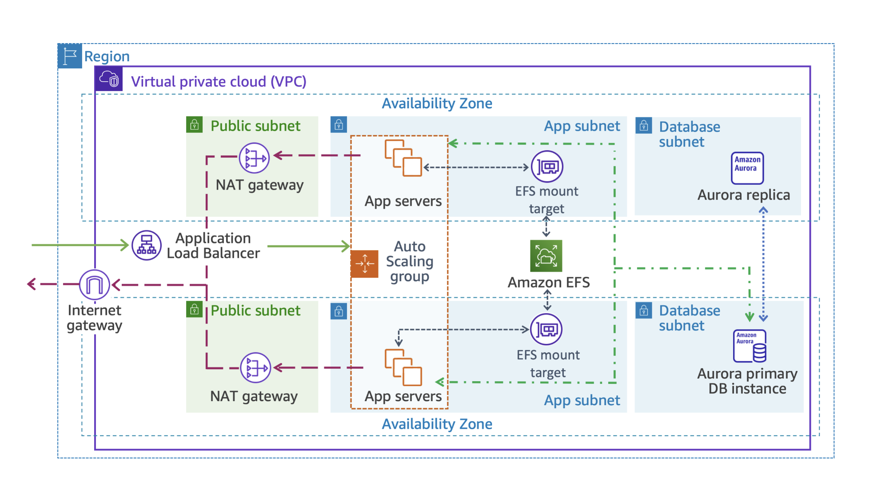
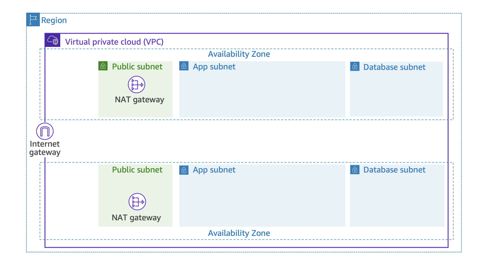
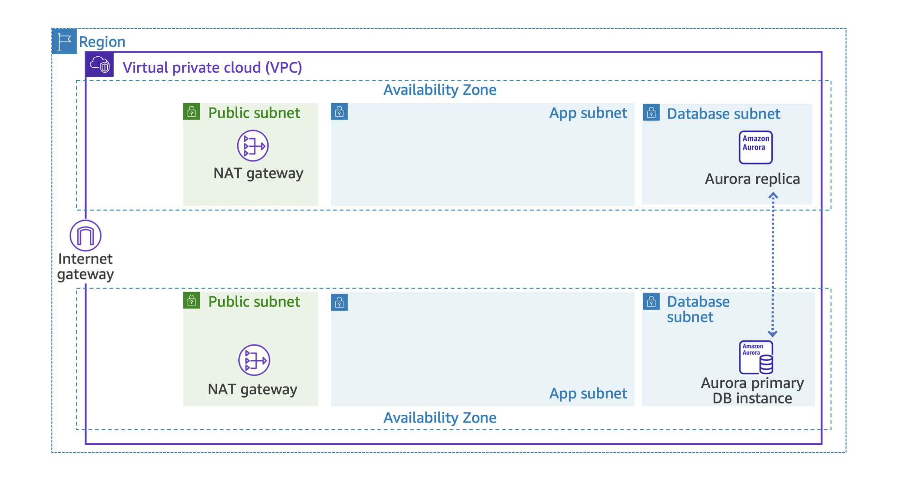
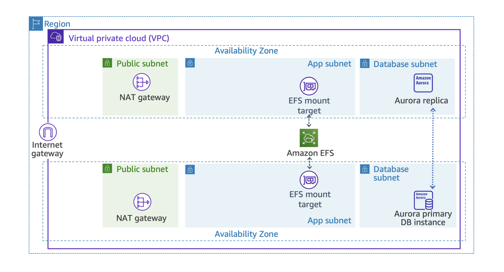
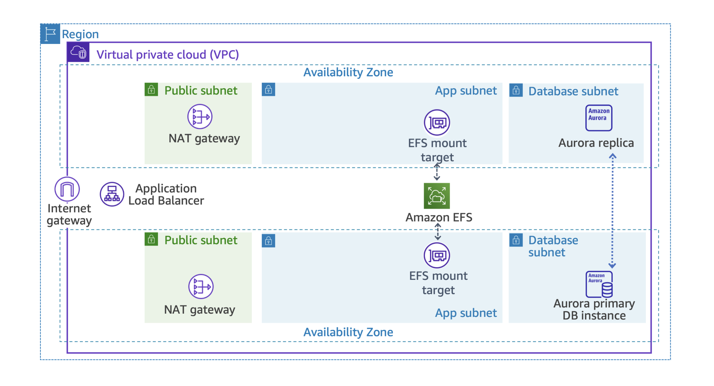
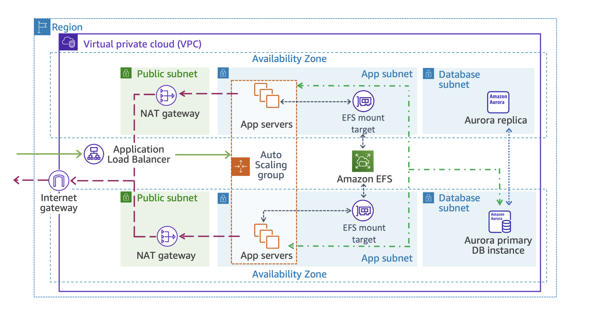

# Session-13: Capstone Project

OVERVIEW

You are tasked with applying your new knowledge to solve several architectural challenges
within a specific business case. First, you are given a list of requirements related to
the design. Then, you perform a series of actions to deploy and configure the servicesneeded
to meet the requirements.

After completing this hands-on, you should be able to do the following:

- Deploy a virtual network spread across multiple Availability Zones in a Region using a
CloudFormation template.
- Deploy a highly available and fully managed relational database across those Availability
Zones (AZ) using Amazon Relational Database Service (Amazon RDS).
- Use Amazon Elastic File System (Amazon EFS) to provision a shared storage layer across multiple
Availability Zones for the application tier, powered by Network File System (NFS).
- Create a group of web servers that automatically scales in response to load variations to
complete your application tier.

SCENARIO

Example Corp. creates marketing campaigns for small-sized to medium-sized businesses. They 
recently hired you to work with the engineering teams to build out a proof of concept for their 
business. To date, they have hosted their client-facing application in an on-premises data center, 
but they recently decided to move their operations to the cloud in an effort to save money and 
transform their business with a cloud-first approach. Some members of their team have cloud 
experience and recommended the AWS Cloud services to build their solution.

In addition, they decided to redesign their web portal. Customers use the portal to access their 
accounts, create marketing plans, and run data analysis on their marketing campaigns. They would 
like to have a working prototype in two weeks. You must design an architecture to support this 
application. Your solution must be fast, durable, scalable, and more cost-effective than their 
existing on-premises infrastructure.



SECTION 1: High-level instructions provide students with a limited set of high-level instructions, 
a list of requirements and configurations, and hints.

SECTION 2: Detailed instructions provide students with step-by-step instructions for each task.
Students are strongly encouraged to attempt the lab only using the high-level instructions.

## Section 1: High-level instructions

In this section, all of the tasks list the requirements and configurations that are required to 
build the solution. Try building the solution using this section only.

### Task 1: Review and run a pre-configured CloudFormation template

In this task, you design and deploy a highly available and scalable deployment of the WordPress 
application stack. You use a CloudFormation template to deploy the networking resources required to 
support the application.

#### Task 1: Scenario

The company wants to deploy a new web application on WordPress on their existing web hosting 
account. The first step is to gather the requirements for the architecture design. To help you get 
started, the network team gave you a list of requirements to ensure there are no issues with the 
existing landscape. This includes the Classless Inter-Domain Routing (CIDR) range for the Amazon 
Virtual Private Cloud (Amazon VPC). Using this address range, build a VPC with two public subnets, 
two private application subnets, and two private database subnets. Make sure you attach an internet 
gateway to the VPC with a NAT gateway for routing traffic. They also requested two Elastic IP 
addresses. Ensure that you associate the following:

-> The public subnet with the internet gateway
-> The private application subnet and private database subnet with the NAT gateway
-> The network team also provided the route tables needed with their subnet associations.

Your cloud engineer has transferred the information request to a CloudFormation template and set up 
the security groups and outputs needed for future deployments. Please review the CloudFormation template 
with your cloud engineer, deploy the template, and check back with the network team to validate that 
the build meets all of their requirements.



#### Task 1: Sub-tasks

-> Download and review the template file to understand the infrastructure being deployed.
-> Upload the template file to create the CloudFormation stack.
-> View created resources from the console.

#### Task 1: Proceed to the AWS Management Console

Now that you have your first task requirements, go ahead and build. Instructions are available in 
Section 2 if you experience challenges, but it’s recommended you try to build first without them.

### Task 2: Create an Amazon RDS database

In this task, you create an Amazon Aurora DB instance and the subnet group to support it.

#### Task 2: Scenario

The network team verified the previous deployment requirements and everything looks good. The next 
phase of the project is to establish a secure backend database to give the database administrator 
(DBA) access for any migration operations before go-live.

The current database requires a lot of administrative overhead and the business has agreed to move 
to a managed database service. They want their architecture to be highly available, so you recommend 
that they set up a Multi-AZ RDS Aurora database layer. After reviewing the proposed design, the DBA 
has outlined the database requirements. Because of previous performance issues, the database does not 
require encryption, and you agree that this is the best choice.

The existing monitoring solution polls data every 10 minutes. The engineering team doesn’t have room 
in the budget for additional features; therefore, enhanced monitoring is not required.



#### Task 2: Sub-tasks

-> Create a new DB subnet group.
-> Create a new Aurora database.
-> Copy the database metadata.

#### Task 2: Requirements and Configuration

DB subnet group

- As your first step, create a DB subnet group from the Amazon RDS console.
- Place the subnet group in the 'Lab VPC'.
- Choose Availability Zone A and Availability Zone B.
- Choose the subnet with 10.0.4.0/24 CIDR block for the DB Subnet in Availability Zone A.
- Choose the subnet with 10.0.5.0/24 CIDR block for the DB Subnet in Availability Zone B.

Amazon Aurora database

- For the 'Master username', leave the default value as 'admin'.
- For the 'Master password', use the 'LabPassword'.
- The database instances need to be 'Amazon Aurora with MySql compatible' and 'burstable-performance' 
DB instance.
- The database instance size needs to be 'db.t3.medium'.
- The database layer needs to be deployed into the 'LabVPC'.
- The subnet group needs to be configured with the 'Database subnets' only.
- The database needs to be configured with the 'RDS Security Group' set up by your security team only.
- Make sure to provide an 'Initial database name', such as 'WPDatabase'.
- Make sure to provide a 'DB cluster identifier', such as 'MyDBCluster'.
- Turn off 'Encryption'.
- Turn off 'Enhanced monitoring'.
- Turn off 'Enable auto minor version upgrade'.
- Turn off 'Enable deletion protection'.

Note: Take note of the following because you need them later:

1. Master username and Master password
2. Initial database name
3. Writer endpoint

Note: If you notice the error “Failed to turn on enhanced monitoring for database mydbcluster 
because of missing permissions” you can safely ignore the error.

#### Task 2: Proceed to the AWS Management Console

Now that you have the requirements, go ahead and build. Instructions are available in Section 2 if 
you experience challenges, but it’s recommended you try to build first without them.

### Task 3: Create an Amazon EFS file system

In this task, you create and configure a custom Amazon EFS file system.

#### Task 3: Scenario

Example Corp. is having issues with the lead time on ordering new hardware. This is slowing down 
their ability to onboard new customers and expand the business. The SysOps team has a request for 
a storage solution built for the cloud. They need to be able to confirm that the backup policies 
and encryption settings meet their internal and regulatory compliance requirements. Managing time, 
cost, and compliance gives Example Corp. a competitive advantage.

You recommend Amazon EFS to the business as a simple, serverless, set-and-forget, elastic file system. 
With Amazon EFS, they can share data securely, without provisioning or managing storage.

Your task is to create an Amazon EFS file system that meets the SysOps team’s requirements.



#### Task 3: Sub-tasks

-> Create a new EFS file system.
-> Copy the EFS file system metadata.

#### Task 3: Requirements and Configuration

Customize the creation of an Amazon EFS file system:

- It must have 'Regional' availability and durability.
- It needs to be 'General Purpose' performance to control costs.
- It needs to have 'Bursting' throughput to scale the system size.
- Turn off 'Automatic backups' and 'Encryption' of data at rest.
- EFS needs to be deployed in 'LabVPC'.
- Select 'Availability Zone ending in “a”' and 'Availability Zone ending in “b”'.
- Assign 'AppSubnet1' and 'AppSubnet2' as subnet IDs.
- Remove the default security group and select 'EFSMountTargetSecurityGroup'.
- It does not need a file system policy created at this time.
Note: Take note of the File system ID. You need it later.

#### Task 3: Proceed to the AWS Management Console

Now that you have the requirements, go ahead and build. Instructions are available in Section 2 if you 
experience challenges, but it’s recommended you try to build first without them.

### Task 4: Create an Application Load Balancer

In this task, you create the Application Load Balancer and a target group.

#### Task 4: Scenario

The SysOps team is excited about the new Amazon EFS configuration and eager to address their next 
pain point. The current application experiences frequent outages because of variable, unexpected traffic 
loads. The SysOps team wants to know if AWS has a service to address this issue that can be used at the 
application layer (Layer 7). On further investigation, you recognize the need for an Application Load 
Balancer for the application servers in the private subnet. Your task is to deploy and configure an Application 
Load Balancer with a health check, and register the required targets.



#### Task 4: Sub-tasks

-> Create an Application Load Balancer.
-> Copy the Application Load Balancer metadata.

#### Task 4: Requirements and Configuration

The Application Load Balancer 'Target group' should be configured to use the LabVPC for load balancing 
instances with the following properties:

Health check path: /wp-login.php
Advanced health check settings:
Healthy threshold: 2
Unhealthy threshold: 10
Timeout: 50
Interval: 60
Leave all other settings at their default values.

The 'Application Load Balancer' needs to be configured in the LabVPC and in the public subnets with the 
following properties:

Subnets: Select all Public subnets.
SecurityGroups: Choose AppInstanceSecurityGroup.
Listener: Forward to the created target group.
Note: Take note of the Application Load Balancer’s DNS name. You need it later.

#### Task 4: Proceed to the AWS Management Console

Now that you have the requirements, go ahead and build. Instructions are available in Section 2 if you 
experience challenges, but it’s recommended you try to build first without them.

### Task 5: Create a launch template using CloudFormation

In this task, you use a CloudFormation template to deploy the WordPress user data within an Amazon 
Elastic Compute Cloud (Amazon EC2) Auto Scaling launch template. The template includes the Amazon 
EFS mount points and the Aurora configurations.

#### Task 5: Scenario

Up to this point, you created the underlying network resources, the database, an Amazon EFS file 
system, and an Application Load Balancer. It’s time to put it all together. Example Corp. already 
has a WordPress account, so the cloud engineer uses the settings and configuration from their existing 
environment to create a CloudFormation template. This includes all of the new resources you provisioned 
to set up a launch template.

Review the CloudFormation template and create all of the necessary resources. Pay special attention 
to the user data script. Check for any errors in the deployment and address those, if needed. After 
that is completed, you can create the application servers to support traffic to the new environment.

#### Task 5: Sub-tasks

-> Obtain and review the CloudFormation template.
-> Upload the template to create the CloudFormation stack.
-> View created resources from the console.
-> View the created launch template.

#### Task 5: Requirements and Configuration

Open the Task5.yaml and deploy it on CloudFormation template. Using the values saved from previous 
tasks, update the following Parameters values at the time of stack creation:

- DB Name: initial database name (from Task 2)
- Database endpoint: Writer endpoint (from Task 2)
- Database User Name: Master username (from Task 2)
- Database Password: Master password (from Task 2)
- WordPress admin username: wpadmin
- WordPress admin password: LabPassword
- WordPress admin email address: Valid email address
- Instance Type: t3.medium
- ALBDnsName: DNS name value (from Task 4).
- LatestAL2023AmiId: Leave the default value.
- WPElasticFileSystemID: File system ID (from Task 3)

#### Task 5: Proceed to the AWS Management Console

Now you have the requirements, go ahead and build the next phase of the project. Instructions are 
available in Section 2 if you experience challenges, but it’s recommended you try to build first 
without them.

### Task 6: Create the application servers by configuring an Auto Scaling group and a scaling policy

In this task, you create the WordPress application servers by configuring an Auto Scaling group 
and a scaling policy.

#### Task 6: Scenario

Now that your template has been deployed, it’s time to create the application servers and auto 
scaling mechanism. In the previous task, you chose to implement auto scaling for the app servers 
to meet the scaling requirements of the project plan.

Create an Auto Scaling group and scaling policy. Verify that the instance status is healthy, and test 
the load balancer availability. Hand the environment over to the engineering teams to validate full 
functionality when the unit test is complete, and ask them for feedback.

When the team is satisfied, ask them to migrate the WordPress site to the AWS environment and test 
the app functionality. A common practice is to introduce examples of failure. If the app is working as 
intended, you would introduce some examples of failure, for example, delete an app server or roll 
back the database to a recent backup. This step is not a part of this lab.



#### Task 6: Sub-tasks

-> Create an Auto Scaling group.
-> Verify the target groups and test the application server through the load balancer.
-> Log in to WordPress and explore.

#### Task 6: Requirements and Configuration

- Use the 'Launch template' from the previous task.
- Use the 'LabVPC' for network settings.
- Use the Application subnets in both Availability Zones.
- Use the existing load balancer and target groups created earlier.
- Use the Elastic Load Balancing (ELB) health check and set the health check grace period to '300' seconds.
- Turn on 'Enable group metrics collection within CloudWatch'.
- Configure the group size:

Desired capacity: 2
Minimum capacity: 2
Maximum capacity: 4

- Configure 'Scaling policies' with 'Target tracking scaling policy' and use the defaults.
- Notifications are out of scope for the lab and do not need to be configured.
- Verify that the 'Auto Scaling group' has launched your EC2 instances.
Test the application using the Application Load Balancer DNS name.

#### Task 6: Proceed to the AWS Management Console

Now that you have the final task requirements, go ahead and build to complete your project! Instructions 
are available in Section 2 if you experience challenges, but it’s recommended you try to build first 
without them.

## Section 2: Detailed instructions

In this section, all of the tasks list step-by-step instructions for reference if you experience challenges 
while building the solution on your own. Have you tried Section 1 to build the solution first?

### Task 1 instructions: Review and run a pre-configured CloudFormation template

#### Task 1.1: Navigate to the CloudFormation console

- At the top of the AWS Management Console, in the search box, search for and choose 'CloudFormation'.

#### Task 1.2: Obtain and review the CloudFormation template

- Review the CloudFormation template.

#### Task 1.3: Create the CloudFormation stack

- Choose 'Create stack'. Choose the 'Create stack' dropdown menu.
- Choose 'With new resources (standard)'.
- The 'Create stack' page is displayed. Configure the following:

-> Select 'Choose an existing template.'
-> Select 'Upload template'.
-> Upload 'Task1.yaml'.
-> Choose 'Next'.

The 'Specify stack details' page is displayed.

Stack name: VPCStack
Parameters: Keep the default values

Choose 'Next'.

- The 'Configure stack options' page is displayed. You can use this page to specify additional parameters. 
You can browse the page, but leave settings at the default values.

Choose 'Next'.

- The 'Review and create page' is displayed. This page is a summary of all settings. At the bottom of the 
page, choose 'Submit'.

The 'stack details' page is displayed. The stack enters the  'CREATE_IN_PROGRESS' status.

- Choose the 'Stack info' tab.
- Occasionally choose the 'Overview' refresh . Wait for the status to change to  'CREATE_COMPLETE'.

Note: This stack can take up to 5 minutes to deploy the resources.

#### Task 1.4: View created resources from the console

- Choose the Resources tab.

The list shows the resources that are being created. CloudFormation determines the optimal order for 
resources to be created, such as creating the VPC before the subnet.

- Review the resources that were deployed in the stack.
- Choose the 'Events' tab and scroll through the list.

The list shows (in reverse order) the activities performed by CloudFormation, such as starting to create a 
resource and then completing the resource creation. Any errors encountered during the creation of the stack 
are listed in this tab.

- Choose the 'Outputs' tab. Review the key-value pairs in the Outputs section. These values might be useful 
in later lab tasks.

### Task 2 instructions: Create an Amazon RDS database

#### Task 2.1: Navigate to the Amazon RDS console

- At the top of the AWS Management Console, in the search box, search for and choose 'RDS'. The Amazon
RDS console page is displayed.

#### Task 2.2: Create a new DB subnet group

- In the left navigation pane, choose 'Subnet groups'.
- Choose 'Create DB subnet group'. The Create DB subnet group page is displayed.

In the 'Subnet group details' section, configure the following:

```text
Name: AuroraSubnetGroup.
Description: A 2 AZ subnet group for my database.
VPC: LabVPC
```

- In the Add subnets section, configure the following:

```text
From the Availability Zones dropdown menu:
Select the  Availability Zone ending in 'a'.
Select the  Availability Zone ending in 'b'.

From the Subnets dropdown menu:
Select the subnet with the CIDR block 10.0.4.0/24 from the Availability Zone ending in 'a'.
Select the subnet with the CIDR block 10.0.5.0/24 from the Availability Zone ending in 'b'.
```

Choose 'Create'.

#### Task 2.3: Create a new Amazon Aurora database

- In the left navigation pane, choose 'Databases'.
- Choose 'Create database'.
- In the 'Choose a database creation method' section, select 'Standard create'.
- In the 'Engine options' section, configure the following:

```text
In 'Engine type', select 'Aurora(MySQL Compatible)'.
```

- In the Templates section, select Production.
- In the Settings section, configure the following:

```text
DB cluster identifier: MyDBCluster.
Master username: Eadmin.
Credentials management: Self managed
Master password: LabPassword
Confirm master password: LabPassword
```

In the 'Instance configuration' section, configure the following:

```text
-> 'DB instance class': 'Burstable classes (includes t classes)'.
-> From the 'instance type' dropdown menu, choose 'db.t3.medium'.
```

- In the 'Availability & durability' section, for 'Multi-AZ deployment', select 'Create an Aurora Replica 
or Reader node in a different AZ (recommended for scaled availability)'.
- In the Connectivity section, configure the following:

```text
Virtual private cloud (VPC): LabVPC
DB subnet group: aurorasubnetgroup
Public access: No
VPC security group (firewall): 'Choose existing'
Existing VPC security groups:
-> Select only the 'xxxxx-RDSSecurityGroup-xxxxx' group from the dropdown menu.
-> To remove the default security group, choose the X.
```

- Expand the 'Additional configuration' section and configure the following:

```text
Database port: Leave the configuration at the default value.

- In the 'Monitoring' section, clear 'Enable Enhanced monitoring'.
- Scroll to the bottom of the page and expand the main  Additional configuration section.

-> In the Database options section, configure the following:

Initial database name: WPDatabase.

-> In the 'Encryption' section, clear 'Enable encryption'.
-> In the 'Maintenance' section, clear 'Enable auto minor version upgrade'.
-> In the 'Deletion protection' section, clear 'Enable deletion protection'.
```

- Scroll to the bottom of the screen and choose Create database.
- On the 'Suggested add-ons for mydbcluster' pop-up window, choose 'Close'.

Note: Your Aurora MySQL DB cluster is in the process of launching. The cluster you configured consists 
of two instances, each in a different Availability Zone. The Amazon Aurora DB cluster can take up to 5 
minutes to launch. Wait for the mydbcluster status to change to Available. You do not have to wait for 
the availability of the instances to continue.

- Choose 'View connection details' displayed on the success message border to save the connection details 
of your 'mydbcluster' database to a text editor.

Note: If you notice the error “Failed to turn on enhanced monitoring for database mydbcluster because of 
missing permissions” you can safely ignore the error.

#### Task 2.4: Copy database metadata

- In the left navigation pane, choose 'Databases'.
- Choose the 'mydbcluster' link.
- Choose the 'Connectivity & security' tab.
- Copy the 'endpoint' value for the 'Writer' instance to a text editor.
- Choose the 'Configuration' tab.
- Copy the 'Master username' value to a text editor.
- For Master password: 'LabPassword'
- In the left navigation pane, choose 'Databases'.
- Choose the 'mydbcluster-instance-x' writer instance link.
- Choose the 'Configuration' tab.
- Copy the 'DB name 'value to a text editor.

### Task 3 instructions: Creating an Amazon EFS file system

#### Task 3.1: Navigate to the Amazon EFS console

- At the top of the AWS Management Console, in the search box, search for and choose 'EFS'.

#### Task 3.2: Create a new file system

- Choose 'Create file system'. The Create file system page is displayed.
- Choose 'Customize'. The File system settings page is displayed.
- In the 'General' section, configure the following:

```text
Name - optional: myWPEFS.
Clear 'Enable automatic backups'.
Clear 'Enable encryption of data at rest'.
Expand the 'Tags - optional' section, configure the following:
Tag key: Name
Tag value - optional: EmyWPEFS.
Leave all other settings at their default value.
```

- Choose 'Next'.
- From the Virtual Private Cloud (VPC) dropdown menu, select 'LabVPC'.
- For 'Mount targets', configure the following:

```text
Availability zone: Availability Zone ending in “a”
Subnet ID: AppSubnet1
Security groups: EFSMountTargetSecurityGroup
(To remove the default Security group, choose the X.)
Availability zone: Availability Zone ending in “b”
Subnet ID: AppSubnet2
Security groups: EFSMountTargetSecurityGroup
(To remove the default Security group, choose the X.)
```

- Choose 'Next'. The 'File system policy – optional page' is displayed.
- Choose 'Next'. The Review and create page is displayed.
- Scroll to the bottom of the page, and choose 'Create'.

The file system state displays as Available after several minutes.

#### Task 3.3: Copy Amazon EFS metadata

- In the left navigation pane, select File systems.
- Copy the 'File system ID' generated for myWPEFS to a text editor. It has a format like fs-a1234567.

### Task 4 instructions: Create an Application Load Balancer

#### Task 4.1: Navigate to the Amazon EC2 console

- At the top of the AWS Management Console, in the search box, search for and choose 'EC2'.

#### Task 4.2: Create a Target group

- In the left navigation pane, under the 'Load Balancing' section, choose 'Target Groups'.
- Choose 'Create target group'.
- In the 'Basic configuration' section, configure the following:

```text
For Choose a target type: Instances.
For Target group name: myWPTargetGroup.
For VPC: LabVPC
```

- In the Health checks section, configure the following:

```text
For Health check path: Enter /wp-login.php
Expand the 'Advanced health check settings' section and configure the following:
Healthy threshold: 2.
Unhealthy threshold: 10
Timeout: 50
Interval: 60
Leave the remaining settings on the page at their default values.
```

- Choose 'Next'.The Register targets page is displayed. There are no targets to register currently.
- Scroll to the bottom of the page and choose 'Create target group'.

#### Task 4.3: Create an Application Load Balancer

- In the left navigation pane, choose 'Load Balancers'.
- Choose 'Create load balancer'. The 'Compare and select load balancer type' page is displayed.
- In the 'Load balancer types' section, for 'Application Load Balancer', choose 'Create'. The 'Create 
Application Load Balancer' page is displayed.
- In the 'Basic configuration' section, configure the following:

For Load balancer name: myWPAppALB

In the 'Network mapping' section, configure the following:

```text
VPC: LabVPC
Mappings:
-> Select the first Availability Zone listed, and select 'PublicSubnet1' from the Subnet dropdown menu.
-> Select the second  Availability Zone listed, and select 'PublicSubnet2' from the Subnet dropdown menu.
```

- In the 'Security groups' section, configure the following:

```text
-> From the 'Security groups' dropdown menu, select 'AppInstanceSecurityGroup'.
-> To remove the 'default' security group, choose the 'X'.
```

- In the 'Listeners and routing' section, configure the following:

```text
For Listener HTTP:80: from the Default action dropdown menu, select myWPTargetGroup.
```

- Scroll to the bottom of the page and choose 'Create load balancer'.

The load balancer is in the 'Provisioning' state for a few minutes and then changes to 'Active'.

- Copy the 'myWPAppALB' load balancer 'DNS name' to a text editor.

### Task 5 instructions: Creating a launch template using CloudFormation

#### Task 5.1: Navigate to the CloudFormation console

- At the top of the AWS Management Console, in the search box, search for and choose 'CloudFormation'.

#### Task 5.2: Obtain and review the CloudFormation template

- Review the CloudFormation template.

#### Task 5.3: Create the CloudFormation stack

- Choose 'Create stack'. Choose the 'Create stack' dropdown menu.
- Choose 'With new resources (standard)'.
- The 'Create stack' page is displayed. Configure the following:

-> Select 'Choose an existing template.'
-> Select 'Upload template'.
-> Upload 'Task5.yaml'.
-> Choose 'Next'.

The Specify stack details page is displayed.

- Set the 'Stack name' as 'WPLaunchConfigStack'.

Configure the following parameters:

```text
DB name: Paste the initial database name you copied in Task 2.
Database endpoint: Paste the writer endpoint you copied in Task 2.
Database User Name: Paste the Master username you copied in Task 2.
Database Password: Paste the Master password you copied in Task 2.
WordPress admin username: wpadmin
WordPress admin password: LabPassword
WordPress admin email address: Input a valid email address.
Instance Type: t3.medium
ALBDnsName: Paste the 'DNS name' value you copied in Task 4.
LatestAL2023AmiId: default
WPElasticFileSystemID: Paste the 'File system ID' value you copied in Task 3.
```

- Choose 'Next'.

The Configure stack options page is displayed. You can use this page to specify additional 
parameters. You can browse the page, but leave settings at their default values.

- Choose 'Next'.

- Scroll to the bottom of the page and choose 'Submit'.

The 'stack details' page is displayed. The stack enters the  'CREATE_IN_PROGRESS' status.

- Choose the Stack info tab. Occasionally choose the 'Overview' refresh. Wait for the stack status to 
change to 'CREATE_COMPLETE'.

Note: This stack can take up to 5 minutes to deploy the resources.

#### Task 5.4: View created resources from the console

- Choose the 'Resources' tab. The list shows the resources that are created.

### Task 6 instructions: Create the application servers by configuring an Auto Scaling group and a scaling policy

#### Task 6.1: Create an Auto Scaling group

- At the top of the AWS Management Console, in the search box, search for and choose 'EC2'.
- In the left navigation pane, under the 'Auto Scaling' section, choose 'Auto Scaling Groups'.
- Choose 'Create Auto Scaling group'.
- The Choose launch template or configuration page is displayed. Configure the following:

```text
Auto Scaling group name: Enter WP-ASG.
Launch template: Select the launch template that you created in Task 5.
```

- Choose 'Next'.
- The Choose instance launch options page is displayed. In the 'Network' section, configure the 
following:

```text
VPC: LabVPC
Availability Zones and subnets: Select AppSubnet1, AppSubnet2 
```

- Choose 'Next'.
- On the 'Configure advanced options' - optional page, configure the following:

```text
Select 'Attach to an existing load balancer'.
Select 'Choose from your load balancer target groups'.
From the 'Existing load balancer target groups dropdown' menu, select 'myWPTargetGroup | HTTP'.
For Additional health check types - optional: 'Turn on Elastic Load Balancing health checks'
Health check grace period: 300
Monitoring: Enable group metrics collection within CloudWatch
```

- Choose 'Next'.

On the 'Configure group size and scaling' - optional page, configure the following:

```text
In the Group size section:
Desired capacity: Enter 2
In the Scaling section:
Min desired capacity: Enter 2
Max desired capacity: Enter 4
```

- In the 'Automatic scaling' - optional section, configure the following:

```text
Select Target tracking scaling policy.
The remaining settings on this section can be left at their default values.
```

- Choose 'Next'. The 'Add notifications' - optional page is displayed.
- Choose 'Next'. The 'Add tags' - optional page is displayed.
- Choose Add tag and then configure the following:

```text
Key: Name
Value - optional: WP-App
```

- Choose 'Next'. The Review page is displayed.
- Review the Auto Scaling group configuration for accuracy, and then at the bottom of the page, 
choose 'Create Auto Scaling group'.
- Now that you have created your Auto Scaling group, you can verify that the group has launched 
your EC2 instances. Choose the Auto Scaling group 'WP-ASG' link.
- To review information about the Auto Scaling group, examine the 'Group details' section.
- Choose the 'Activity' tab.

The 'Activity history' section maintains a record of events that have occurred in your Auto Scaling 
group. The Status column contains the current status of your instances. When your instances are 
launching, the status column shows 'PreInService'. The status changes to 'Successful' after an instance 
is launched.

- Choose the 'Instance management' tab.

Your Auto Scaling group has launched two Amazon EC2 instances and they are in the 'InService' 
lifecycle state. The Health Status column shows the result of the Amazon EC2 instance health check 
on your instances.

If your instances have not reached the InService state yet, you need to wait a few minutes. You can 
choose the refresh button to retrieve the current lifecycle state of your instances.

- Choose the 'Monitoring' tab. Here, you can review monitoring-related information for your Auto Scaling group.

This page provides information about activity in your Auto Scaling group, as well as the usage and health 
status of your instances. The 'Auto Scaling' tab displays Amazon CloudWatch metrics about your Auto Scaling 
group, while the 'EC2' tab displays metrics for the Amazon EC2 instances managed by the Auto Scaling group.

#### Task 6.2: Verify the target groups are healthy

- Expand the navigation menu by choosing the menu icon in the upper-left corner.
- In the left navigation pane, choose 'Target Groups'.
- Choose the 'myWPTargetGroup' link.
- In the 'Targets' tab, wait until the instance Health status is displayed as 'healthy'.

Note: It can take up to 5 minutes for the health checks to show as healthy. Wait for the Health status to 
display healthy before continuing.

#### Task 6.3: Log in to the WordPress web application

- In the left navigation pane, choose 'Load Balancers'.
- Copy the 'myWPAppALB' load balancer 'DNS name' to a text editor and append the value '/wp-login.php' to 
the end of the DNS name to complete your WordPress application URL.

Example of a completed WordPress application URL:

```text
myWPAppELB-4e009e86b4f704cc.elb.us-west-2.amazonaws.com/wp-login.php
```

- Paste the WordPress application URL value into a new browser tab.
The WordPress login page is displayed.

- Enter the following:

```text
Username or Email Address: wpadmin
Password: LabPassword
```

- Choose the Log in button.
