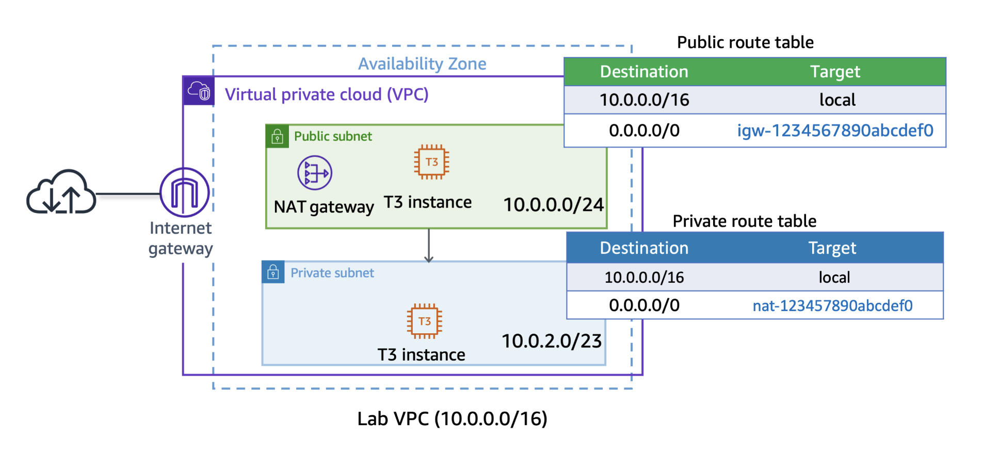
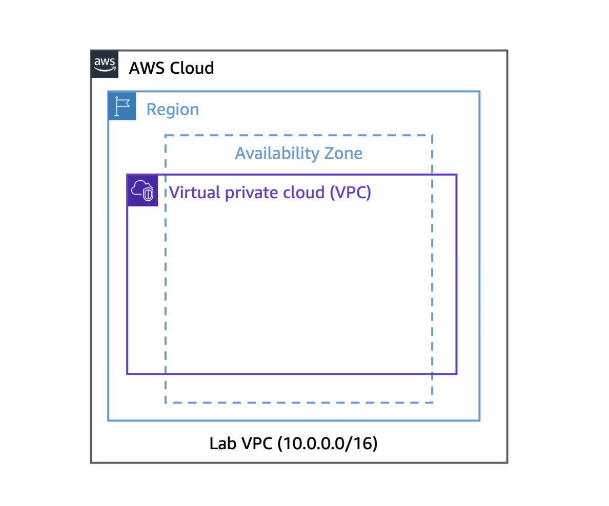
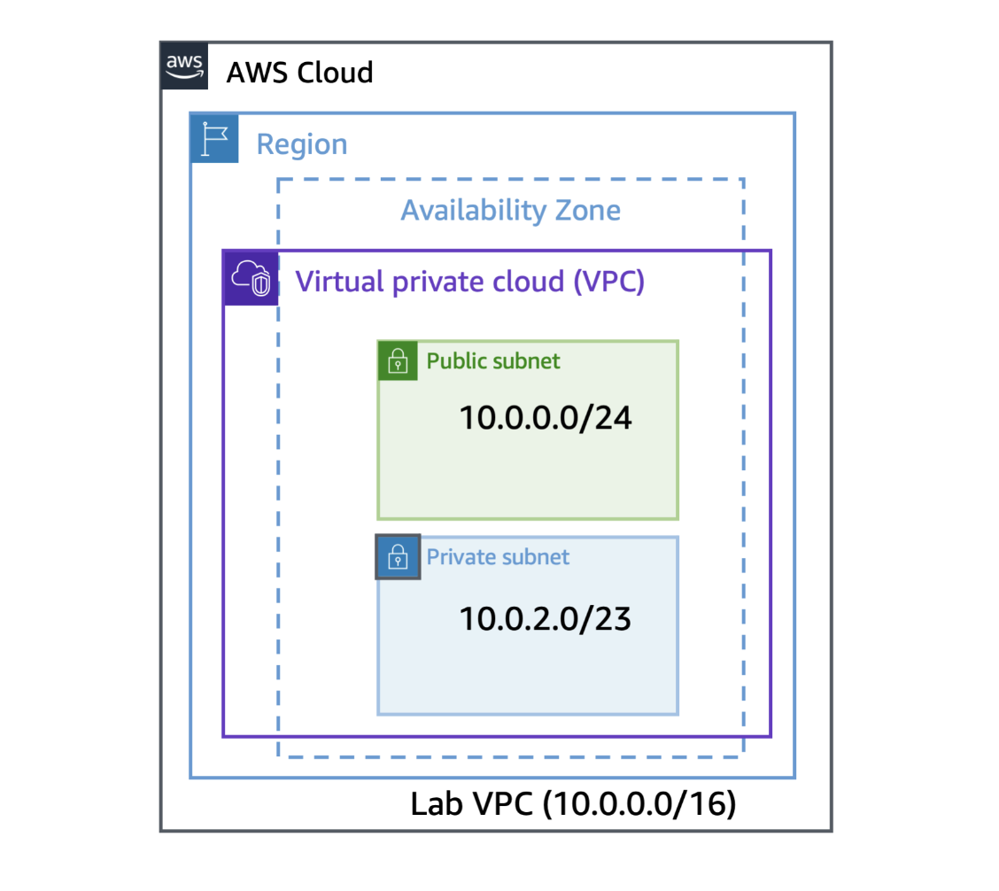
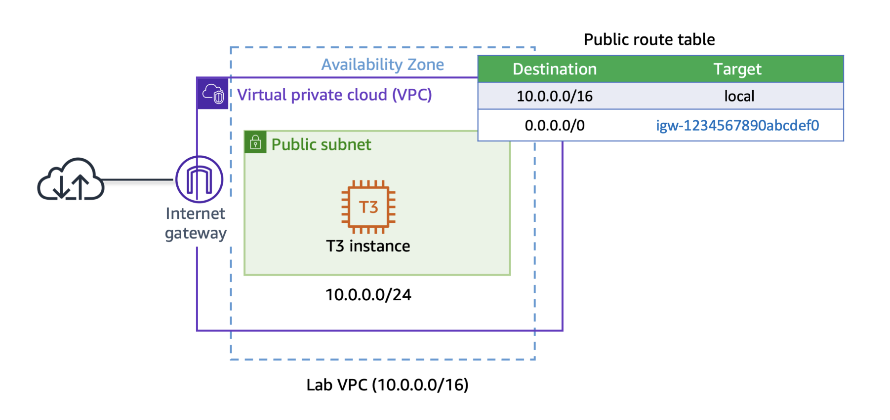

# Hands-on 2: Building your Amazon VPC Infrastructure

OVERVIEW

As an AWS solutions architect, it is important that you understand the overall functionality and capabilities of 
Amazon Web Service (AWS) and the relationship between the AWS networking components. In this hands-on, you create 
an Amazon Virtual Private Cloud (Amazon VPC), a public and a private subnet in a single Availability Zone, public 
and private routes, a NAT gateway, and an internet gateway. These services are the foundation of networking architecture 
inside of AWS. This architecture design covers concepts of infrastructure, design, routing, and security.



After completing this hands-on, you should know how to do the following:

- Create an Amazon VPC.
- Create public and private subnets.
- Create an internet gateway.
- Configure a route table and associate it to a subnet.
- Create an Amazon Elastic Compute Cloud (Amazon EC2) instance and make the instance publicly accessible.
- Isolate an Amazon EC2 instance in a private subnet.
- Create and assign security groups to Amazon EC2 instances.
- Connect to Amazon EC2 instances using Session Manager, a capability of AWS Systems Manager.

## Task 1: Create an Amazon VPC in a Region

With Amazon VPC, you can provision a logically isolated section of the AWS Cloud where you can launch AWS resources 
in a virtual network that you define. You have complete control over your virtual networking environment, including 
selection of your own IP address ranges, creation of subnets, and configuration of route tables and network gateways. 
You can also use the enhanced security options in Amazon VPC to provide more granular access to and from the Amazon 
EC2 instances in your virtual network.



- Type 'VPC' in the search bar and choose it. In the left navigation pane, choose 'Your VPCs'. 
- Choose 'Create VPC' and follow these settings:

```text
Resources to create: Choose 'VPC only'
Name tag: Lab-VPC
IPv4 CIDR: 10.0.0.0/16
```

and choose 'Create VPC'.

This VPC has a Classless Inter-Domain Routing (CIDR) range of 10.0.0.0/16, which includes all IP addresses that start 
with 10.0.x.x. This range contains over 65,000 addresses. You later divide the addresses into separate subnets.

- After noticing that VPC is Available, choose 'Actions' and 'Edit VPC settings'
- In the displayed page, select the 'Enable DNS hostnames' under 'DNS settings' section and choose 'Save'.

This option assigns a friendly Domain Name System (DNS) name to Amazon EC2 instances in the VPC, such as 
'ec2-52-42-133-255.us-west-2.compute.amazonaws.com'.

## Task 2: Create public subnets and private subnets

To add a new subnet to your VPC, you must specify an IPv4 CIDR block for the subnet from the range of your VPC. 
You can specify the Availability Zone in which you want the subnet to reside. You can have multiple subnets in 
the same Availability Zone.



A subnet is a sub-range of IP addresses within a network. You can launch AWS resources into a specified subnet. 
Use a public subnet for resources that must be connected to the internet, and use a private subnet for resources 
that are to remain isolated from the internet.

### Task 2.1: Create your public subnet

The public subnet is for internet-facing resources.

- In the left navigation pane, choose 'Subnets' and 'Create subnet'.
- Follow these settings:

```text
VPC ID: Lab-VPC
Subnet name: Public Subnet
Availability Zone: Select the first Availability Zone
IPv4 subnet CIDR block: 10.0.0.0/24
```

and choose 'Create subnet'.

The VPC has a CIDR range of 10.0.0.0/16, which includes all 10.0.x.x IP addresses. The subnet you just created 
has a CIDR range of 10.0.0.0/24, which includes all 10.0.0.x IP addresses. These ranges might look similar, but 
the subnet is smaller than the VPC because of the /24 in the CIDR range.

Now, configure the subnet to automatically assign a public IP address for all instances launched within it.

- Select the 'Public Subnet' and choose 'Actions' and 'Edit Subnet Settings'.
- From the Auto-assign IP settings section, select 'Enable auto-assign public IPv4 address' and choose 'Save'.

### Task 2.2: Create your private subnet

The private subnet is for resources that are to remain isolated from the internet.

- Choose 'Create subnet' and follow these settings:

```text
VPC ID: Lab-VPC
Subnet name: Private Subnet
Availability Zone: Select the first Availability Zone
IPv4 subnet CIDR block: 10.0.2.0/23
```

and choose 'Create subnet'.

The CIDR block of 10.0.2.0/23 includes all IP addresses that start with 10.0.2.x and 10.0.3.x. This is twice as 
large as the public subnet because most resources should be kept private, unless they specifically need to be accessible 
from the internet.

## Task 3: Create an internet gateway

In this task, you create an internet gateway so that internet traffic can access the public subnet. To grant access to 
or from the internet for instances in a subnet in a VPC, you create an internet gateway and attach it to your VPC. 

- In the left navigation pane, choose 'Internet gateways'.
- Choose 'Create internet gateway' and follow these settings:

```text
Name tag: Lab-IGW
```

and choose 'Create internet gateway'.

You can now attach the internet gateway to your VPC.

- Select the internet gateway and choose 'Actions' and 'Attach to VPC'.
- From available VPCs, choose 'Lab-VPC' and choose 'Attach internet gateway'.

## Task 4: Route internet traffic in the public subnet to the internet gateway

In this task, you create a route table and add a route to the route table to direct internet-bound traffic to your 
internet gateway and associate your public subnets with your route table. Each subnet in your VPC must be associated 
with a route table; the table controls the routing for the subnet. A subnet can only be associated with one route 
table at a time, but you can associate multiple subnets with the same route table.

A route table contains a set of rules, called routes, that are used to determine where network traffic is directed. To 
use an internet gateway, your subnet’s route table must contain a route that directs internet-bound traffic to the internet 
gateway. You can scope the route to all destinations not explicitly known to the route table (0.0.0.0/0 for IPv4 or ::/0 
for IPv6), or you can scope the route to a narrower range of IP addresses. If your subnet is associated with a route table 
that has a route to an internet gateway, it’s known as a public subnet.

- In the left navigation pane, choose 'Route tables'.
- Choose 'Create route table' and follow these settings:

```text
Name: Public Route Table
VPC: Lab-VPC
```

and choose 'Create route table'.

- Choose the 'Routes' tab in the lower half of the page.

There is one route in your route table that allows traffic within the 10.0.0.0/16 network to flow within the network, but 
it does not route traffic outside of the network.

- Choose 'Edit routes' and 'Add route'.

```text
Destination: 0.0.0.0/0
Target: Choose Internet Gateway' in the dropdown menu, and then choose the displayed internet gateway ID.
```

and choose 'Save changes'.

- Choose the 'Subnet associations' tab and choose 'Edit subnet associations'.
- Select 'Public Subnet' and choose 'Save associations'.

## Task 5: Create a public security group

In this task, you create a security group so that users can access your Amazon EC2 instance. Security groups in a VPC 
specify which traffic is allowed to or from an Amazon EC2 instance.

You can use Amazon EC2 security groups to help secure instances within an Amazon VPC. By using security groups in a VPC, 
you can specify both inbound and outbound network traffic that is allowed to or from each Amazon EC2 instance. Traffic 
that is not explicitly allowed to or from an instance is automatically denied.

NOTE: It is recommended to use HTTPS protocol to improve web traffic security. However, to simplify this hands-on, only 
HTTP protocol is used.

- In the left navigation pane, choose 'Security groups'.
- Choose 'Create security group' and follow these settings:

```text
Security group name: Public SG
Description: Allows incoming traffic to public instance
VPC: Lab-VPC
Inbound rules: Add rule (Type: HTTP, Source: Anywhere-IPv4)
Tags: Add new tag (Key: Name, Value: Public SG)
```

and choose 'Create security group'.

## Task 6: Launch an Amazon EC2 instance into a public subnet

In this task, you launch an Amazon EC2 instance into a public subnet. To activate communication over the internet for 
IPv4, your instance must have a public IPv4 address that’s associated with a private IPv4 address on your instance. By 
default, your instance is only aware of the private (internal) IP address space defined within the VPC and subnet.



The internet gateway that you created logically provides the one-to-one NAT on behalf of your instance. So when traffic 
leaves your VPC subnet and goes to the internet, the reply address field is set to the public IPv4 address or Elastic IP 
address of your instance, and not its private IP address.

- At the top of the AWS Management Console, in the search bar, search for and choose 'EC2'.

### Task 6.1: Begin the instance configuration

- From the console navigation menu on the left, choose 'EC2 Dashboard'.
- From the 'Launch instances' section, choose 'Launch instances'.

### Task 6.2: Add tags to the instance

You can use tags to categorize your AWS resources in different ways, such as by purpose, owner, or environment. You can 
apply tags to most AWS Cloud resources. Each tag consists of a key and a value, both of which you define. One use of tags 
is for when you must manage many resources of the same type. You can quickly search for and identify a specific resource 
by the tag you have applied to it.

- Locate the 'Name and tags' section. In the 'Name' field, enter 'Public Instance'.

### Task 6.3: Select an AMI

The AMI contains a copy of the disk volume used to launch the instance.

- Locate the 'Application and OS Images (Amazon Machine Image)' section.
- Ensure that 'Amazon Linux' is selected as the OS.
- Ensure that 'Amazon Linux 2023 AMI' is selected in the dropdown menu.

### Task 6.4: Choose the Amazon EC2 instance type

Each instance type allocates a specific combination of virtual CPUs (vCPUs), memory, disk storage, and network performance.

- From the 'Instance type' dropdown menu, choose 't3.micro'.

### Task 6.5: Configure key pair for login

- From the 'Key pair name - required' dropdown menu, choose 'Proceed without a key pair (Not recommended)'.

### Task 6.6: Configure instance networking

- Locate the 'Network settings' section and choose 'Edit'. Configure the following settings from the dropdown menu:

```text
VPC: Lab-VPC
Subnet: Public Subnet
Auto-assign public IP: Enable
```

### Task 6.7: Configure instance security groups

You can use security groups to define both the allowed/denied and the inbound/outbound traffic for the elastic network 
interface. The network interface is attached to an Amazon EC2 instance. Port 80 is the default port for HTTP traffic, 
and it is necessary for the web server you launch in this hands-on to work correctly.

- For 'Firewall (security groups)', choose 'Select existing security group'
- From the 'Common security groups' dropdown menu, choose the security group that has a name like 'Public SG'.

### Task 6.8: Add storage

You can use the Configure storage section to specify or modify the storage options for the instance and add additional 
Amazon Elastic Block Store (Amazon EBS) disk volumes attached to the instance. The EBS volumes can be configured in both 
their size and performance.

The default storage settings are all that is needed. No changes are required.

### Task 6.9: Configure user data

To install and configure the new instance as a web server, you provide a user data script that automatically runs when the 
instance launches.

- Locate and expand the 'Advanced details' section. In the 'User data - optional' section, copy and paste the following:

```bash
#!/bin/bash
# To connect to your EC2 instance and install the Apache web server with PHP
yum update -y
yum install -y httpd php8.1
systemctl enable httpd.service
systemctl start httpd
cd /var/www/html
wget https://hepapi-aws-session-files.s3.ap-northeast-1.amazonaws.com/Session2-Networking%26Security/instanceData.zip
# wget  https://us-west-2-tcprod.s3.amazonaws.com/courses/ILT-TF-200-ARCHIT/v7.7.11.prod-feed4ba8/lab-2-VPC/scripts/instanceData.zip
unzip instanceData.zip
```

### Task 6.10: Review the instance launch

- Locate the 'Summary' section and choose 'Launch instance'.
- Choose 'View all instances'.

The Amazon EC2 instance named Public Instance is initially in a 'Pending' state. The instance state then changes to 'Running'
indicating that the instance has finished booting.

## Task 7: Connect to a public instance through HTTP

In this task, you connect to the public instance and launch the basic Apache web server page. The inbound rules added 
earlier that allow HTTP access (port 80) allow you to connect to the web server running Apache.

- In the left navigation pane, choose 'Instances'. Select 'Public Instance'.
- Choose the 'Networking' tab in the lower pane. Locate the 'Public IPv4 DNS' value.
- Copy the public DNS value. Open a new browser tab and paste the public DNS value for Public Instance in the URL address bar.

The web page hosted on the Amazon EC2 instance is displayed. The page displays the instance ID and the AWS Availability Zone 
where the Amazon EC2 instance is located.

- Close the browser tab and return to the console.

## Task 8: Connect to the Amazon EC2 instance in the public subnet through Session Manager

Session Manager is a fully managed AWS Systems Manager capability that you use to manage your Amazon EC2 instances through 
an interactive one-click browser-based shell or through the AWS Command Line Interface (AWS CLI). You can use Session Manager 
to start a session with an Amazon EC2 instance in your account. After starting the session, you can run bash commands as you 
would through any other connection type.

- At the top of the AWS Management Console, in the search bar, search for and choose EC2.
- In the left navigation pane, choose Instances. Select  Public Instance and choose Connect.
- Choose the Session Manager tab. Choose Connect.

With Session Manager, you can connect to Amazon EC2 instances without needing to expose the SSH port on your firewall or Amazon 
VPC security group.

- Enter the following command to change to the home directory:

```bash
cd ~
curl -I https://aws.amazon.com/training/
```

## Task 9: Create a NAT gateway and configuring routing in the private subnet

In this task, you create a NAT gateway and then create a route table to route non-local traffic to the NAT gateway. You 
then attach the route table to the private subnet. You can use a NAT gateway to allow instances in a private subnet to 
connect to the internet or other AWS services, but prevent the internet from initiating a connection with those instances.

To create a NAT gateway, you must specify the public subnet in which the NAT gateway should reside. You must also specify 
an Elastic IP address to associate with the NAT gateway when you create it. You cannot change the Elastic IP address after 
you associate it with the NAT gateway. After you’ve created a NAT gateway, you must update the route table associated with 
one or more of your private subnets to point internet-bound traffic to the NAT gateway. This allows instances in your private 
subnets to communicate with the internet.

- Return to the AWS Management Console browser tab.
- At the top of the AWS Management Console, in the search box, search for and choose VPC.
- In the left navigation pane, choose NAT gateways. Choose Create NAT gateway and configure the following:

```text
Name - optional: Enter Lab NGW.
Subnet: Select Public Subnet from the dropdown menu.
For Elastic IP allocation ID, choose Allocate Elastic IP.
```

Choose Create NAT gateway.

Create a new route table for a private subnet that redirects non-local traffic to the NAT gateway.

- In the left navigation pane, choose Route tables. Choose Create route table and configure the following:

```text
Name - optional: Enter Private Route Table.
VPC: Select Lab VPC from the dropdown menu.
```

Choose Create route table. The private route table is created and the details page for the private route table is displayed.

Choose the Routes tab. Choose Edit routes. Choose Add route and then configure the following:

```text
Destination: Enter 0.0.0.0/0.
Target: Choose NAT Gateway in the dropdown menu, and then choose the displayed NAT Gateway ID.
```

Choose Save changes.

- Choose the Subnet associations tab. Choose Edit subnet associations.
- Select  Private Subnet. Choose Save associations.

This route sends internet-bound traffic from the private subnet to the NAT gateway that is in the same Availability Zone.

## Task 10: Create a security group for private resources

In this task, you create a security group that allows incoming HTTP traffic from resources assigned to the public security 
group. In a multi-tiered architecture, resources in a private subnet are should not directly accessible from the internet, 
however their is a common use case to route web traffic from publicly accessible resources to private resources.

When you specify a security group as the source for a rule, traffic is allowed from the network interfaces that are associated 
with the source security group for the specified port and protocol. Incoming traffic is allowed based on the private IP 
addresses of the network interfaces that are associated with the source security group (and not the public IP or Elastic IP 
addresses). Adding a security group as a source does not add rules from the source security group.

- In the left navigation pane, choose Security groups.
- Choose Create security group, and then configure the following:

```text
Security group name: Public SG
Description: Allows incoming traffic to public instance
VPC: Lab-VPC
Inbound rules: Add rule (Type: HTTP, Source: Anywhere-IPv4)
Tags: Add new tag (Key: Name, Value: Public SG)
```

and choose 'Create security group'.

## Task 11: Launch an Amazon EC2 instance into a private subnet

Private instances can route their traffic through a NAT gateway or a NAT instance to access the internet. Private instances 
use the public IP address of the NAT gateway or NAT instance to traverse the internet. The NAT gateway or NAT instance allows 
outbound communication but doesn’t allow machines on the internet to initiate a connection to the privately addressed instances.

- At the top of the AWS Management Console, in the search bar, search for and choose 'EC2'.

### Task 11.1: Begin the instance configuration

- From the console navigation menu on the left, choose 'EC2 Dashboard'.
- From the 'Launch instances' section, choose 'Launch instances'.

### Task 11.2: Add tags to the instance

- Locate the 'Name and tags' section. In the 'Name' field, enter 'Private Instance'.

### Task 11.3: Select an AMI

The AMI contains a copy of the disk volume used to launch the instance.

- Locate the 'Application and OS Images (Amazon Machine Image)' section.
- Ensure that 'Amazon Linux' is selected as the OS.
- Ensure that 'Amazon Linux 2023 AMI' is selected in the dropdown menu.

### Task 11.4: Choose the Amazon EC2 instance type

Each instance type allocates a specific combination of virtual CPUs (vCPUs), memory, disk storage, and network performance.

- From the 'Instance type' dropdown menu, choose 't3.micro'.

### Task 11.5: Configure key pair for login

- From the 'Key pair name - required' dropdown menu, choose 'Proceed without a key pair (Not recommended)'.

### Task 11.6: Configure instance networking

- Locate the 'Network settings' section and choose 'Edit'. Configure the following settings from the dropdown menu:

```text
VPC: 'Lab-VPC'
Subnet: 'Private Subnet'
Auto-assign public IP: 'Disable'
```

### Task 11.7: Configure instance security groups

- For 'Firewall (security groups)', choose 'Select existing security group'.
- From the 'Common security groups' dropdown menu, choose the security group that has a name like 'Private SG'.

### Task 11.8: Add storage

You can use the 'Configure storage' section to specify or modify the storage options for the instance and add additional 
Amazon Elastic Block Store (Amazon EBS) disk volumes attached to the instance. The EBS volumes can be configured in both 
their size and performance.

The default storage settings are all that is needed. No changes are required.

### Task 11.9: Configure user data

To install and configure the new instance as a web server, you provide a user data script that automatically runs when the 
instance launches.

- Locate and expand the 'Advanced details' section. In the 'User data - optional' section, copy and paste the following:

```bash
#!/bin/bash
# To connect to your EC2 instance and install the Apache web server with PHP
yum update -y
yum install -y httpd php8.1
systemctl enable httpd.service
systemctl start httpd
cd /var/www/html
wget https://hepapi-aws-session-files.s3.ap-northeast-1.amazonaws.com/Session2-Networking%26Security/instanceData.zip
# wget  https://us-west-2-tcprod.s3.amazonaws.com/courses/ILT-TF-200-ARCHIT/v7.7.11.prod-feed4ba8/lab-2-VPC/scripts/instanceData.zip
unzip instanceData.zip
```

### Task 11.10: Review the instance launch

- Locate the 'Summary' section and choose 'Launch instance'.
- Choose 'View all instances'.

The Amazon EC2 instance named Private Instance is initially in a 'Pending' state. The instance state then changes to 
'Running' indicating that the instance has finished booting.

## Task 12: Connect to the Amazon EC2 instance in the private subnet

- In the left navigation pane, choose 'Instances'. Select 'Private Instance' and choose 'Connect'.
- Choose the 'Session Manager' tab. Choose 'Connect'. 

A new browser tab or window opens with a connection to the 'Private Instance'.

- Enter the following command to change to the home directory: 

```bash
cd ~
curl -I https://aws.amazon.com/training/
```

## (Optional) Task 1: Troubleshooting connectivity between the private instance and the public instance

In this optional task, you use the Internet Control Message Protocol (ICMP) to validate a private instance’s network 
reachability from the public instance.

- Return to the AWS Management Console browser tab. In the left navigation pane, choose 'Instances'.
- Select 'Private Instance'. On the 'Details' tab, copy the value of 'Private IPv4 addresses' to your clipboard.
- Unselect 'Private Instance'. Select 'Public Instance'. Choose 'Connect'.
- Choose the 'Session Manager' tab. Choose 'Connect'.

A new browser tab or window opens with a connection to the 'Public Instance'. First, use a curl command to retrieve 
a header file and confirm is the web app hosted on the private instance is reachable from the public instance.

- Copy the following command to your notepad. Replace 'PRIVATE_IP' with the value of the 'Private IPv4 address' for 
the 'Private Instance':

```bash
curl PRIVATE_IP
```

- Copy the following command to your notepad. Replace 'PRIVATE_IP' with the value of the 'Private IPv4 address' for the 
'Private Instance':

```bash
ping PRIVATE_IP
```

- After a few seconds, stop the ICMP ping request by pressing CTRL+C.

The ping request to the private instance fails. Your challenge is to use the console and figure out the correct inbound 
rule required in the 'Private SG' to be able to successfully ping the private instance.

- Return to the AWS Management Console browser tab. At the top of the AWS Management Console, in the search box, search 
for and choose 'EC2'.
- In the left navigation pane, choose 'Security Groups'. Select 'Private SG'.
- Choose 'Actions' and then choose 'Edit inbound rules'.
- On the 'Edit inbound rules' page, in the 'Inbound rules', choose 'Add rule' and configure the following:

```text
Type: Custom ICMP - IPV4
Source: Custom
In the box to the right of 'Custom', type 'sg' and choose 'Public SG' from the list.
```

Choose 'Save rules'. Go to the Optional Task and re-run the steps. The 'Public Instance' should now be able to successfully 
ping 'Private Instance'.

## (Optional) Task 2: Retrieving instance metadata

In this optional task, you run instance metadata commands on AWS CLI using a tool such as cURL. Instance metadata is available 
from your running Amazon EC2 instance. This can be helpful when you write scripts to run from your Amazon EC2 instance.

- Return to the browser tab with the AWS Management Console open. In the left navigation pane, choose 'Instances'.
- Select 'Public Instance'. Choose 'Connect'.
- Choose the 'Session Manager' tab. Choose 'Connect'.

A new browser tab or window opens with a connection to the 'Public Instance'.

- To view all categories of instance metadata from within a running instance, run the following command:

```bash
TOKEN=`curl -X PUT "http://169.254.169.254/latest/api/token" -H "X-aws-ec2-metadata-token-ttl-seconds: 21600"` \
&& curl -H "X-aws-ec2-metadata-token: $TOKEN" -v http://169.254.169.254/latest/meta-data/
```

- Run the following command to retrieve the public-hostname (one of the top-level metadata items that were obtained in the 
preceding command):

```bash
curl http://169.254.169.254/latest/meta-data/public-hostname -H "X-aws-ec2-metadata-token: $TOKEN"
```

The IP address 169.254.169.254 is a link-local address and is valid only from the instance.

## Conclusion

Creating a VPC with both public and private subnets provides you the flexibility to launch tasks and services in either a 
public or private subnet. Tasks and services in the private subnets can access the internet through a NAT gateway.
