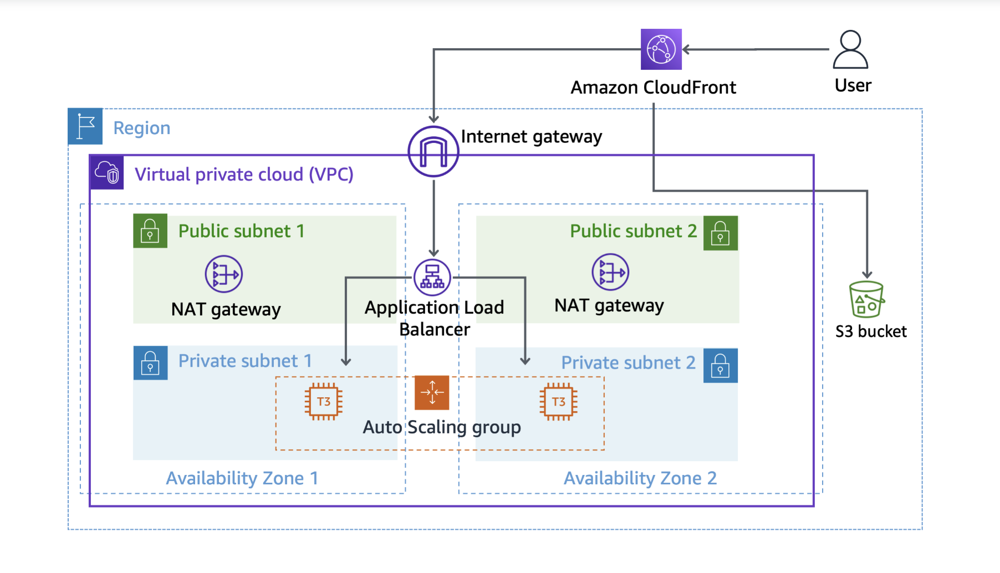

# Hands-on 5: Configuring an Amazon CloudFront Distribution with an Amazon S3 Origin

OVERVIEW

Amazon Web Services (AWS) solutions architects must frequently design and build secure, high-performing, 
resilient, efficient architectures for applications and workloads to deliver content. Amazon CloudFront 
is a web service that provides a cost-effective way to distribute content with low latency and high data 
transfer speeds. You can use CloudFront to accelerate static website content delivery, serve video on demand 
or live streaming video, and even run serverless code at the edge location. In this lab, you configure a 
CloudFront distribution in front of an Amazon Simple Storage Service (Amazon S3) bucket and secure it using 
origin access control (OAC) provided by CloudFront.

After completing this hands-on, you should be able to do the following:

- Create an S3 bucket with default security settings.
- Configure an S3 bucket for public access.
- Add an S3 bucket as a new origin to an existing CloudFront distribution.
- Secure an S3 bucket to permit access only through the CloudFront distribution.
- Configure OAC to lock down security to an S3 bucket.
- Configure Amazon S3 resource policies for public or OAC access.



Services used in this lab

Amazon CloudFront

CloudFront is a content delivery web service. It integrates with other AWS products so that developers and 
businesses can distribute content to end users with low latency, high data transfer speeds, and no minimum usage 
commitments.

You can use CloudFront to deliver your entire website, including dynamic, static, streaming, and interactive 
content, using a global network of edge locations. CloudFront automatically routes requests for your content to 
the nearest edge location to deliver content with the best possible performance. CloudFront is optimized to work 
with other AWS services, like Amazon S3, Amazon Elastic Compute Cloud (Amazon EC2), Elastic Load Balancing (ELB), 
and Amazon Route 53. CloudFront also works seamlessly with any origin server that doesn’t use AWS, which stores 
the original, definitive versions of your files.

Amazon Simple Storage Service (Amazon S3)

Amazon S3 provides developers and information technology teams with secure, durable, highly scalable object storage. 
Amazon S3 has a simple web services interface to store and retrieve any amount of data from anywhere on the web.

You can use Amazon S3 alone or together with other AWS services such as Amazon EC2, Amazon Elastic Block Store 
(Amazon EBS), and Amazon Simple Storage Service Glacier (Amazon S3 Glacier), along with third-party storage repositories 
and gateways. Amazon S3 provides cost-effective object storage for a wide variety of use cases, including cloud 
applications, content distribution, backup and archiving, disaster recovery, and big data analytics.

## Task 1: Create an S3 bucket

In this task, you create and configure a new S3 bucket. This bucket is used as a new origin for the CloudFront distribution.

- At the top of the console, in the search bar, search for and choose 'S3'.
- In the Buckets section, choose 'Create bucket'.
- Copy the 'LabBucketName-NUMBER' and paste into the 'Bucket name' field.
Leave all other settings on this page as the default configurations.
- Choose 'Create bucket'.

## Task 2: Configure the S3 LabBucket for public access

In this task, you review the default access setting for S3 buckets. Next, you modify the permissions settings to allow 
public access to the bucket.

### Task 2.1: Configure the LabBucket to allow public policies to be created

- Select the link for the newly created LabBucket found in the 'Buckets' section.
- Choose the 'Permissions' tab.
- Locate the 'Block public access (bucket settings)' section.
- Choose 'Edit'.

The 'Edit Block public access (bucket settings)' page is displayed.

- Unselect 'Block all public access'.
- Choose 'Save Changes'.

A message window titled Edit Block public access (bucket settings) is displayed.

- In the message field, enter 'confirm'.
- Choose 'Confirm'.

You have removed the block on all public access policies for the LabBucket. You are now able to create access policies 
for the bucket that allow for public access. The bucket is currently not public, but anyone with the appropriate 
permissions can grant public access to objects stored within the bucket.

### Task 2.2: Configure a public read policy for the LabBucket

You now create a public object read policy for this bucket.

- On the 'Permissions' tab, locate the 'Bucket policy' section.
- Choose 'Edit'. The 'Edit bucket policy' page is displayed.

Copy edit: Copy and paste the 'Bucket ARN' value into a text editor to save the information for later. It is a string 
value like arn:aws:s3:::LabBucket located above the Policy box.

The ARN value uniquely identifies this S3 bucket. You need this specific ARN value when creating bucket based policies.

- File contents: Copy and paste the following JSON into a text editor.

```bash
{
    "Version": "2012-10-17",
    "Id": "Policy1621958846486",
    "Statement": [
        {
            "Sid": "OriginalPublicReadPolicy",
            "Effect": "Allow",
            "Principal": "*",
            "Action": [
                "s3:GetObject",
                "s3:GetObjectVersion"
            ],
            "Resource": "RESOURCE_ARN"
        }
    ]
}
```

- Replace the 'RESOURCE_ARN' value in the JSON with the 'Bucket ARN' value you copied in a previous step and append a /* 
to the end of the pasted 'Bucket ARN' value.

By appending the /* wildcard to the end of the ARN, the policy definition applies to all objects located in the bucket.

Here is the example of the updated policy JSON:

```bash
{
    "Version": "2012-10-17",
    "Id": "Policy1621958846486",
    "Statement": [
        {
            "Sid": "OriginalPublicReadPolicy",
            "Effect": "Allow",
            "Principal": "*",
            "Action": [
                "s3:GetObject",
                "s3:GetObjectVersion"
            ],
            "Resource": "arn:aws:s3:::lab-bucket-1234/*"
        }
    ]
}
```

- Return to the 'Amazon S3 console'.
- Paste the completed JSON into the 'Policy' box.
- Choose 'Save changes'.

Caution: If you receive an error message at the bottom of the screen, it’s probably caused by a syntax error with JSON. 
The policy will not save until the JSON is valid. You can expand the error message in the Amazon S3 console for more 
information about correcting the policy.

By using the * wildcard as the Principal value, all identities requesting the actions defined in the policy document 
are allowed to do so. By appending the /* wildcard to the allowed Resources, this policy applies to all objects located 
in the bucket.

Note: The policies currently applied to the bucket make the objects in this bucket publicly readable.

## Task 3: Upload an object into the bucket and testing public access

In this task, you upload a single object to the LabBucket. You use this object to test access in the remaining tasks.

### Task 3.1: Create a new folder in the bucket

- Choose the 'Objects' tab.
- Choose 'Create folder'.
- Enter 'CachedObjects' into the 'Folder name' field.
- Leave all other settings on the page at the default values.
- Choose 'Create folder'.

### Task 3.2: Upload an object to the bucket

- Download the object for these hands-on by choosing 'logo.png' and saving it to your local device.
- Return to the 'Amazon S3' Console.
- Choose the link for the 'CachedObjects/' folder that you created previously.
- Choose 'Upload'. The Upload page is displayed.
- Choose 'Add files'.
- Choose the 'logo.png' object from your local storage location.
- Choose 'Upload'. The 'Upload: status' page is displayed.

### Task 3.3: Test public access to an object

- Choose the logo.png link from the 'Files and folders' section. A page with details about the Amazon S3 
object is displayed.
- Select the link located in the 'Object URL' field. The picture is displayed in a browser tab.
- Inspect the URL for the object and notice it is an Amazon S3 URL.
- Close this page with the object.

## Task 4: Secure the bucket with Amazon CloudFront and Origin Access Control

In a previous task, you have confirmed public access to the LabBucket works, but are not utilizing the CloudFront 
distribution for object access. In this task, you add the lab bucket as an new origin to the CloudFront distribution 
and make the objects in the LabBucket accessible only from the CloudFront distribution.

### Task 4.1: Create a new Distribution (OAC)

In this task, you add the LabBucket as a new origin to the a new CloudFront' distribution.

- At the top of the console, in the search bar, search for and choose 'CloudFront'.
- From the 'CloudFront Distributions' page, choose the 'Create Distribution'. The 'Create Distribution' page is 
displayed.
- From the 'Origin domain' field, choose the name of your LabBucket from the 'Amazon S3' section.

Note: Recall that the S3 bucket is never configured as a website. You have only changed the bucket policy regarding 
who is allowed to perform GetObject API requests against the S3 bucket into an Allow Public read policy.

- Leave the entry for 'Origin path' empty.

Note: The Origin Path field is optional and configures which directory in the origin CloudFront should forward 
requests to. In this hands-on, rather than configuring the origin path, you leave it blank and instead configure 
a behavior to return only objects matching a specific pattern in the requests.

- For 'Name', enter 'My Amazon S3 Origin'.
- For 'Origin access', select 'Origin access control settings(recommended)'.
- Choose 'Create new OAC'. The console displays the 'Create new OAC' message window.
- Leave the default settings and choose 'Create'.
- Under 'WAF' section, choose 'Do not Enable Security Protections'.
- Choose 'Create distribution'.

You can safely ignore any message like, 'The S3 bucket policy needs to be updated' as you completed updating the 
bucket policy already.

### Task 4.2: Explore the properties of the distribution

- Examine the contents of the 'General' tab.

This tab contains the details about the current configuration of this particular CloudFront distribution. It 
contains the most generally needed information about a distribution. It is also where you configure the common 
high-level items for the distribution, such as activating the distribution, logging, and certificate settings.

- Copy edit: From the 'Details' section, in the 'General' tab, copy the 'ARN' value and save it in a text editor.
- Copy edit: From the 'Details' section, in the 'General' tab, copy the 'Distribution' domain name value.
- Paste the 'Distribution domain value' you copied into a new browser tab.

A simple web page is loaded displaying the information of the web server from which CloudFront retrieved the 
content. By requesting content from the Distribution domain value for the CloudFront distribution, you are 
verifying that the existing cache is working.

You can close this tab.

- Return to the 'CloudFront' console.
- Choose the 'Security' tab.

This tab contains the distribution’s configuration if you need to keep your application secure from the most 
common web threats using AWS WAF or need to prevent users in specific countries from accessing your content using 
geographic restrictions.

- Choose the 'Origins' tab.

This tab contains the details about the current origins that exist for this particular CloudFront distribution. It 
is also the area of the console you can use to configure new or existing CloudFront origins. A CloudFront Origin 
defines the location of the definitive, original version of the content that is delivered through the CloudFront 
distribution.

- Return to the 'CloudFront' console.
- Choose the 'Behaviors' tab.

Behaviors define the actions that the CloudFront distribution takes when there is a request for content, such as 
which origin to serve which content, Time To Live of content in the cache, cookies, and how to handle various headers.

This tab contains a list of current behaviors defined for the distribution. You configure new or existing behaviors 
here. Behaviors for the distribution are evaluated in the explicit order in which you define them on this tab.

Do the following to review or edit the configuration of any single behavior:

-> Select the radio button  in the row next to the behavior you want to modify.
-> Choose 'Edit'.
-> Choose 'Cancel' to close the page and return to the console.

There is only one behavior currently configured in this environment. The behavior accepts HTTP and HTTPS for both 
GET and HEAD requests to the load balancer origin.

- Choose the 'Error Pages' tab.

This tab details which error page is to be returned to the user when the content requested results in an HTTP 4xx 
or 5xx status code. You can configure custom error pages for specific error codes here.

- Choose the 'Invalidations' tab.

This tab contains the distribution’s configuration for object invalidation. 'Invalidated' objects are removed from 
CloudFront edge caches. A faster and less expensive method is to use versioned objects or directory names. There 
are no invalidations configured for CloudFront distributions by default.

- Choose the 'Tags' tab.

This tab contains the configuration for any tags applied to the distribution. You can view and edit existing tags 
and create new tags here. Tags help you identify and organize your distributions.

### Task 4.3: Update the bucket policy for the LabBucket

Update the bucket policy to allow read-only access from the CloudFront distribution.

- At the top of the console, in the search bar, search for and choose 'S3'.
- Select the link for the 'LabBucket' found in the 'Buckets' section. A page with all of the bucket details is displayed.
- Choose the 'Permissions' tab.
- Locate the 'Bucket policy' section.
- Choose 'Edit'. The 'Edit bucket policy' page is displayed.
- Copy edit: Copy and paste the Bucket ARN value into a text editor to save the information for later. It is a string 
value like arn:aws:s3:::LabBucket located above the Policy box.
- File contents: Copy and paste the following JSON into a text editor.

```bash
{
    "Version": "2012-10-17",
    "Statement": {
        "Sid": "AllowCloudFrontServicePrincipalReadOnly",
        "Effect": "Allow",
        "Principal": {
            "Service": "cloudfront.amazonaws.com"
        },
        "Action": [
            "s3:GetObject",
            "s3:GetObjectVersion"
        ],
        "Resource": "RESOURCE_ARN",
        "Condition": {
            "StringEquals": {
                "AWS:SourceArn": "CLOUDFRONT_DISTRIBUTION_ARN"
            }
        }
    }
}
```

- Replace the 'RESOURCE_ARN' value in the JSON with the 'Bucket ARN' value you copied in a previous step and append 
a '/*' to the end of the pasted Bucket ARN value.
- Replace the 'CLOUDFRONT_DISTRIBUTION_ARN' value in the JSON with the ARN value of the previously created Cloudfront 
Distribution ARN.

Here is the example of the updated policy JSON:

```bash
{
    "Version": "2012-10-17",
    "Id": "Policy1621958846486",
    "Statement": [
        {
            "Sid": "OriginalPublicReadPolicy",
            "Effect": "Allow",
            "Principal": "*",
            "Action": [
                "s3:GetObject",
                "s3:GetObjectVersion"
            ],
            "Resource": "arn:aws:s3:::lab-bucket-1234/*"
        "Condition": {
            "StringEquals": {
                "AWS:SourceArn": "arn:aws:cloudfront::123456789:distribution/E3LU8VQUNZACBE"
            }
        }
    }
}
```

- Return to the 'Amazon S3 console'.
- Paste the completed JSON into the 'Policy' box.
- Choose 'Save changes'.

### Task 4.4: Enable the public access blockers

- On the 'Permissions' tab, locate the 'Block public access (bucket settings)' section.
- Choose 'Edit'. The 'Edit Block public access (bucket settings)' page is displayed.
- Select 'Block all public access'.
- Choose 'Save changes'. A message window titled Edit Block public access (bucket settings) is displayed.
- In the field of the message window, enter 'confirm'.
- Choose 'Confirm'. A page with all the bucket details is displayed.

### Task 4.5: Create a new behavior for the Amazon S3 origin

In this task, you create a new behavior for the Amazon S3 origin so that the distribution has instructions for how to 
handle incoming requests for the origin.

- Choose the 'Behaviors' tab.
- Choose 'Create behavior'. The 'Create behavior' page is displayed.
- In the 'Path pattern' field, enter 'CachedObjects/*.png'.

This field configures which matching patterns of object requests the origin can return. Specifically, in this behavior 
only .png objects stored in the CachedObjects folder of the Amazon S3 origin can be returned. Unless there is a behavior 
configured for them, all other requests to the Amazon S3 origin would result in an error being returned to the requester. 
Typically, users would not be requesting objects directly from the CloudFront distribution URL in this manner; instead, 
your frontend application would generate the correct object URL to return to the user.

- From the 'Origin and origin groups' dropdown menu, choose 'My Amazon S3 Origin'.
- From the 'Cache key and origin requests' section, ensure 'Cache policy and origin request policy (recommended)' is selected.
- From the 'Cache policy' dropdown menu, ensure 'CachingOptimized' is selected.
- Leave all other settings on the page at the default values. Choose 'Create behavior'.

A 'Successfully created new cache behavior CachedObjects/*.png.' message is displayed on top of the screen.

## Task 5: Test direct access to a file in the bucket using the Amazon S3 URL

In this task, you test if the object can still be directly accessed using the Amazon S3 URL.

- At the top of the console, in the search bar, search for and choose 'S3'.
- Select the link for the 'LabBucket 'found in the 'Buckets' section.
- Choose the Objects tab. Choose the link for the 'CachedObjects/' folder.
- Choose the link for the 'logo.png' object. Select the link located in the 'Object URL' field.

An error message is displayed with Access denied messages. This is expected because the new bucket policy does not 
allow access to the object directly from Amazon S3 URLs. By denying access to S3 objects directly through Amazon S3, 
users can no longer bypass the controls provided by CloudFront cache, which can include logging, behaviors, signed URLs, 
or signed cookies.

## Task 6: Test access to the object in the bucket using the CloudFront distribution

In this task, you confirm that you can access objects in the Amazon S3 origin for the CloudFront distribution.

- 'Copy edit': Copy the CloudFront distribution’s domain DNS value. Paste the DNS value into a new browser tab.

A simple web page is loaded displaying the information of the web server where CloudFront retrieved the content from.

- Append '/CachedObjects/logo.png' to the end of the CloudFront distribution’s domain DNS and press Enter.

The browser makes a request to the CloudFront distribution and the object is returned from the Amazon S3 origin.

Hint: If the CloudFront URL redirects you to the Amazon S3 URL, or if the object isn’t immediately available, the 
CloudFront distribution might still be updating from your recent changes. Return to the CloudFront console. Select 
'Distributions' from the navigation menu. Confirm that the Status column is 'Enabled' and the Last modified column has 
a timestamp. You need to wait for this before testing the new origin and behavior. After you have confirmed the status 
of the distribution, wait a few minutes and try this task again.

## Optional Task 1: Replicate an S3 bucket across AWS Regions

Cross-Region replication is a feature of Amazon S3 that allows for automatic copying of your data from one bucket to 
another bucket located in a different AWS Region. It is a useful feature for disaster recovery. After the cross-Region 
replication feature is enabled for a bucket, every new object that you currently have read permissions for, which is 
created in the source bucket, is replicated into the destination bucket you define. This means that objects replicated 
to the destination bucket have the same names. Objects encrypted using an Amazon S3 managed encryption key are encrypted 
in the same manner as their source bucket.

To perform Cross-Region replication, you must enable object versioning for both the source and destination buckets. To 
maintain good data orderliness with versioning enabled, you can deploy lifecycle policies to automatically archive objects 
to Amazon S3 Glacier or to delete the objects.

### Optional Task 1.1: Enable versioning on your source bucket

- Return to the browser tab open to the AWS Management Console.
- At the top of the console, in the search bar, search for and choose 'S3'.
- Select the link for the LabBucket found in the 'Buckets' section.
- A page with all the bucket details is displayed. Select the 'Properties' tab.
- Locate the Bucket Versioning section. Choose 'Edit'.
- The 'Edit Bucket Versioning' page is displayed. Select 'Enable for Bucket Versioning'. Choose 'Save changes'.

### Optional Task 1.2: Create a destination bucket for cross-Region replication

- From the Amazon S3 navigation menu, choose 'Buckets'.
- Navigate to another Region to create the bucket.
- Choose 'Create bucket'. The 'Create bucket' page is displayed.
- In the 'Bucket name' field, enter a unique bucket name.
- In the 'Block Public Access settings for this bucket' section, unselect 'Block all public access'.

In the warning message, select 'I acknowledge that the current settings might result in this bucket and the objects within 
becoming public'.

- For 'Bucket Versioning', select 'Enable'.Choose 'Create bucket'. The 'Amazon S3 console' is displayed.

Note: This newly created bucket is referred to as the DestinationBucket in the remainder of hands-on.

### Optional Task 1.3: Configure a public read policy for the new destination bucket

You now create a public object read policy for this bucket. You use the public read policy to demonstrate that objects are 
replicated and retrievable using the Amazon S3 URL. It is not recommended for most use cases to use bucket policies which 
allow for public access.

- From the Amazon S3 navigation menu, choose 'Buckets'.
- Choose the link for the 'DestinationBucket' from the list of buckets.
- Choose the 'Permissions' tab. Locate the 'Bucket policy' section.
- Choose 'Edit'. The 'Edit bucket policy 'page is displayed.
- Copy edit: Copy and paste the 'Bucket ARN' value into a text editor to save the information for later. It is a string value 
like arn:aws:s3:::LabBucket located above the Policy box.

The ARN value uniquely identifies this S3 bucket. You need this specific ARN value when creating bucket-based policies.

File contents: Copy and paste the following JSON into a text editor:

```bash
{
    "Version": "2012-10-17",
    "Id": "Policy1621958846486",
    "Statement": [
        {
            "Sid": "OriginalPublicReadPolicy",
            "Effect": "Allow",
            "Principal": "*",
            "Action": [
                "s3:GetObject",
                "s3:GetObjectVersion"
            ],
            "Resource": "RESOURCE_ARN"
        }
    ]
}
```

- Replace the 'RESOURCE_ARN' value in the JSON with the 'Bucket ARN' value you copied in a previous step and append a 
'/*' to the end of the pasted 'Bucket ARN' value. Here is the example of the updated policy JSON:

```bash
{
    "Version": "2012-10-17",
    "Id": "Policy1621958846486",
    "Statement": [
        {
            "Sid": "OriginalPublicReadPolicy",
            "Effect": "Allow",
            "Principal": "*",
            "Action": [
                "s3:GetObject",
                "s3:GetObjectVersion"
            ],
            "Resource": "arn:aws:s3:::DestinationBucket/*"
        }
    ]
}
```

- Return to the 'Amazon S3 console'. Paste the completed JSON into the 'Policy' box.
- Choose Save changes. The 'bucket details' page is displayed.

Note: The policies currently applied to the bucket make the objects in this bucket publicly readable.

### Optional Task 1.4: Create a replication rule

- From the Amazon S3 navigation menu, choose 'Buckets'.
- In the 'Buckets' section, choose the link for the 'LabBucket'.
- Choose the 'Management' tab. Locate the 'Replication rules' section.
- Choose 'Create replication' rule. The 'Create replication rule' page is displayed.
- In the 'Replication rule name' field, enter 'MyCrossRegionReplication'
- Verify that 'LabBucket' is set for 'Source bucket name'. If it is not, then you chose the incorrect bucket before choosing 
the replication rules.
- In the 'Choose a rule scope' section, select 'Apply to all objects in the bucket'.
- Locate the 'Destination' section. Choose 'Browse S3'.
- Select the 'DestinationBucket'. Select 'Choose path'.
- Locate the 'IAM Role' section. Select 'Create new role'.
- Leave all other options as their default selection.
- Choose 'Save'.
- If the Replicate existing objects window is displayed, select 'No, do not replicate existing objects' then choose 'Submit'.

The 'Replication rules' page for the LabBucket is displayed.

A "Replication configuration successfully updated If changes to the configuration aren’t displayed, choose the refresh 
button. Changes apply only to new objects. To replicate existing objects with this configuration, choose Create replication 
job." message is displayed on top of the screen.

All newly created objects in the LabBucket are replicated into the DestinationBucket.

### Optional Task 1.5: Verify object replication

- From the Amazon S3 navigation menu, choose 'Buckets'. You might need to expand the menu by choosing the menu icon.
- In the 'Buckets' section, choose the link for the 'LabBucket'.
- Download the object for these lab instructions by right-clicking logo2.png and saving it to your local device.
- Return to the 'Amazon S3' console.
- Choose the link for the 'CachedObjects/' folder.

Note: If you do not find the CachedObjects folder, choose 'Buckets' from the navigation menu located on the left side of the 
console. Then choose the link for the 'LabBucket' from the list. Finally, choose the 'Objects' tab to ensure that you are at 
the correct page.

- Choose 'Upload'. The 'Upload' page is displayed.
- Choose 'Add files'. Choose the 'logo2.png' object from your local storage location.
- Choose 'Upload'. The 'Upload: status' page is displayed.
- Choose the link for the 'logo2.png' from the 'Files and folders' section.
- In the 'Object management overview' section, examine 'Replication status' and refresh the page periodically until it changes 
from 'PENDING' to 'COMPLETED'.
- From the Amazon S3 navigation menu, select 'Buckets'.
- In the 'Buckets' section, choose the link for the 'DestinationBucket'.
- Choose the link for the 'CachedObjects/' folder.
- In the 'Files and folders' section, choose the link for the 'logo2.png'.
- In the 'Object management overview' section, examine 'Replication Status'. It displays 'REPLICA'.
- Choose the link located in the 'Object URL' field. The picture is displayed in a browser tab.
